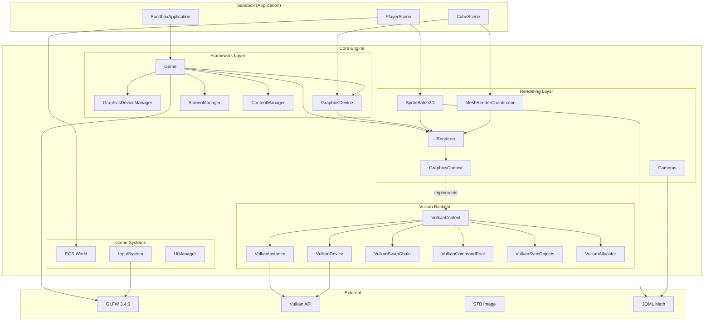
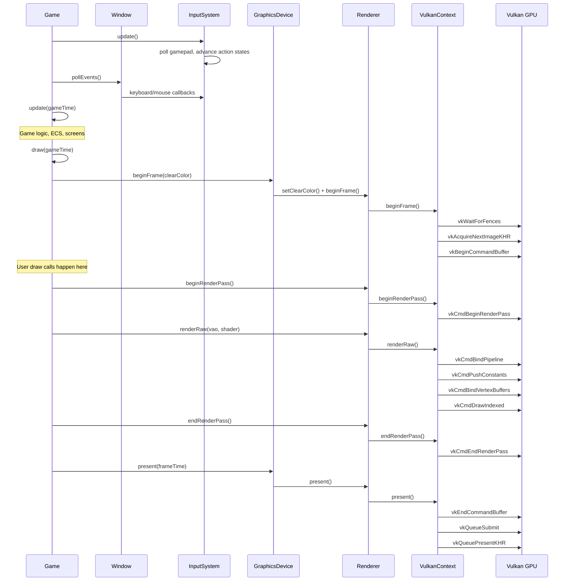

# 2. Architecture Overview

## Design Philosophy

The engine follows **MonoGame's architecture** adapted to Java:

- **`Game`** is the central class (like MonoGame's `Game`)
- **`GraphicsDevice`** is the public GPU facade
- **`GraphicsDeviceManager`** configures the graphics backend
- **`Screen`** / **`ScreenManager`** manage game states (like MonoGame's `GameScreen`)
- **`ContentManager`** handles asset loading with caching
- **`SpriteBatch2D`** batches 2D draw calls (like MonoGame's `SpriteBatch`)

## High-Level Module Map



## Core Design Patterns

| Pattern | Where | Why |
|---------|-------|-----|
| **Singleton** | `Window`, `Renderer`, `VulkanContext` | One GPU context, one window |
| **Abstract Factory** | `RenderBackendFactory` | Backend-agnostic object creation |
| **Strategy** | `GraphicsContext` interface | Swap rendering backends |
| **Facade** | `Renderer`, `GraphicsDevice` | Simple API over complex Vulkan calls |
| **Template Method** | `Game`, `SystemBase`, `Camera2D/3D` | Lifecycle hooks for subclasses |
| **Dirty Flag** | Cameras, transforms | Avoid recomputing unchanged matrices |
| **Object Pool** | Entity ID recycling, descriptor pool-of-pools | Reduce allocations |
| **Deferred Release** | `VulkanContext.deferRelease()` | GPU-safe resource destruction |

## Data Flow: One Frame



## Abstraction Layers

The rendering system has three abstraction levels:

```
┌─────────────────────────────────────────────┐
│          Game Code (Sandbox)                 │
│  Uses: GraphicsDevice, SpriteBatch2D,       │
│        Mesh3D, Shader, Texture2D            │
├─────────────────────────────────────────────┤
│          Engine Facade                       │
│  Renderer, RenderBackendFactory             │
│  Abstract: Shader, VertexArray, Texture2D   │
├─────────────────────────────────────────────┤
│          Backend Implementation              │
│  VulkanContext, VulkanShader,               │
│  VulkanVertexArray, VulkanTexture2D, etc.   │
├─────────────────────────────────────────────┤
│          LWJGL / Vulkan API                  │
└─────────────────────────────────────────────┘
```

Game code never touches Vulkan directly. It works with abstract types (`Shader`, `VertexArray`, `Texture2D`) created through `RenderBackendFactory`. This allows a future OpenGL or other backend to be swapped in by implementing `GraphicsContext` and `RenderBackendFactory`.
