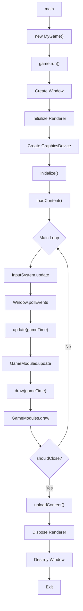

# 3. Application Lifecycle

## The Game Class

`Game` (`core/src/main/java/hu/mudlee/core/Game.java`) is the abstract base class for all applications. It owns the main loop and orchestrates every subsystem.

### Creating a Game

```java
public class MyGame extends Game {
    public MyGame() {
        var gdm = new GraphicsDeviceManager(this);
        gdm.setPreferredBackBufferWidth(1920);
        gdm.setPreferredBackBufferHeight(1080);
        gdm.setTitle("My Game");
        gdm.setVSync(true);
        gdm.setPreferredBackend(RenderBackend.VULKAN);
    }

    @Override
    protected void initialize() {
        // One-time setup after GPU is ready
    }

    @Override
    protected void loadContent() {
        // Load assets via content manager
    }

    @Override
    protected void update(GameTime gameTime) {
        // Game logic every frame
    }

    @Override
    protected void draw(GameTime gameTime) {
        graphicsDevice.beginFrame(Color.BLACK);
        // Draw calls here
        graphicsDevice.present(gameTime.elapsedSeconds());
    }

    @Override
    protected void unloadContent() {
        // Cleanup
    }
}
```

### Lifecycle Flow



### Lifecycle Methods (in call order)

| Method | When | Purpose |
|--------|------|---------|
| Constructor | App start | Configure `GraphicsDeviceManager`, add modules |
| `initialize()` | After GPU init | One-time setup (create cameras, screens) |
| `loadContent()` | After initialize | Load assets (textures, shaders, fonts) |
| `update(GameTime)` | Every frame | Game logic, input processing |
| `draw(GameTime)` | Every frame | Rendering commands |
| `unloadContent()` | On exit | Dispose assets |

## GameTime

`GameTime` (`core/src/main/java/hu/mudlee/core/GameTime.java`) is passed to `update()` and `draw()` every frame:

| Field | Type | Description |
|-------|------|-------------|
| `elapsedSeconds` | `float` | Delta time since last frame (seconds) |
| `totalSeconds` | `float` | Total elapsed time since game start |
| `runningSlowly` | `boolean` | True if frame took longer than target |

## GameModule

`GameModule` (`core/src/main/java/hu/mudlee/core/GameModule.java`) is a pluggable extension that hooks into the game loop. Register modules in the constructor:

```java
public MyGame() {
    var screenManager = new ScreenManager();
    addModule(screenManager);
}
```

GameModule lifecycle methods mirror Game's:

| Method | Called by |
|--------|----------|
| `update()` | After `Game.update()` |
| `draw()` | After `Game.draw()` |
| `resize(w, h)` | On window resize |
| `dispose()` | On shutdown |

Built-in modules:
- **`ScreenManager`** — Manages a stack of `Screen` instances
- **`UIManager`** — Overlay UI rendering (debug stats, etc.)

## GraphicsDeviceManager

`GraphicsDeviceManager` (`core/src/main/java/hu/mudlee/core/GraphicsDeviceManager.java`) is a fluent builder that configures the window and rendering backend before the game loop starts.

| Setting | Default | Description |
|---------|---------|-------------|
| `preferredBackBufferWidth` | 800 | Window width in pixels |
| `preferredBackBufferHeight` | 600 | Window height in pixels |
| `title` | "Game" | Window title |
| `vSync` | true | Vertical sync |
| `fullscreen` | false | Fullscreen mode |
| `preferredBackend` | VULKAN | Rendering backend |

## GraphicsDevice

`GraphicsDevice` (`core/src/main/java/hu/mudlee/core/GraphicsDevice.java`) is the public GPU facade available in your game code via `this.graphicsDevice`:

```java
// Start a frame with a clear color
graphicsDevice.beginFrame(Color.CORNFLOWER_BLUE);

// Access the viewport
var viewport = graphicsDevice.getViewport();

// Access the backend for advanced usage
var backend = graphicsDevice.getBackend();

// Submit and present the frame
graphicsDevice.present(gameTime.elapsedSeconds());
```
