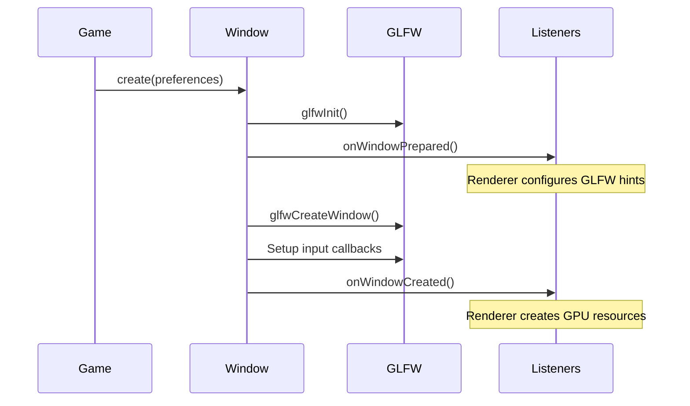

# 4. Window Management

## Window

`Window` (`core/src/main/java/hu/mudlee/core/window/Window.java`) is a singleton that wraps a GLFW window. It is created by `Game.run()` before the renderer initializes.

### Initialization Flow



The two-phase creation (`onWindowPrepared` → `onWindowCreated`) is critical for Vulkan. The Vulkan backend needs to set GLFW hints (like `GLFW_NO_API`) **before** the window is created, then create the Vulkan surface **after**.

### Event Listeners

`Window` dispatches events to registered `WindowEventListener` instances:

```java
public interface WindowEventListener {
    void onWindowPrepared();   // Before GLFW window creation
    void onWindowCreated();    // After GLFW window creation
    void onWindowResized();    // On resize
}
```

The `Renderer` (via `VulkanContext`) is the primary listener. It uses these hooks to:
- Set GLFW window hints during `onWindowPrepared()`
- Create the Vulkan surface, swapchain, and command pools during `onWindowCreated()`
- Recreate the swapchain during `onWindowResized()`

### Input Callbacks

Window registers GLFW callbacks and forwards them to `InputSystem`:

| GLFW Callback | Forwarded To |
|---------------|-------------|
| `glfwSetKeyCallback` | `InputSystem.processKey()` |
| `glfwSetCursorPosCallback` | `InputSystem.processMouseMove()` |
| `glfwSetMouseButtonCallback` | `InputSystem.processMouseButton()` |
| `glfwSetScrollCallback` | `InputSystem.processMouseScroll()` |
| `glfwSetJoystickCallback` | `InputSystem.onGamepadConnected/Disconnected()` |

### Key Properties

| Method | Returns | Description |
|--------|---------|-------------|
| `getId()` | `long` | GLFW window handle |
| `getSize()` | `Vector2i` | Window size in screen coordinates |
| `getPixelRatio()` | `float` | HiDPI scale factor |
| `shouldClose()` | `boolean` | True if user closed the window |
| `setCursorMode(CursorMode)` | — | NORMAL, HIDDEN, or DISABLED |

## CursorMode

`CursorMode` (`core/src/main/java/hu/mudlee/core/window/CursorMode.java`):

| Mode | Behavior |
|------|----------|
| `NORMAL` | Standard cursor, visible and free |
| `HIDDEN` | Cursor invisible but still tracks position |
| `DISABLED` | Cursor captured and hidden (for FPS camera) |

## ScreenPixelRatioHandler

`ScreenPixelRatioHandler` (`core/src/main/java/hu/mudlee/core/window/ScreenPixelRatioHandler.java`) detects the HiDPI / Retina scale factor by comparing framebuffer size to window size. This ratio is used to correctly size viewports and UI elements on high-DPI displays.

## WindowPreferences

`WindowPreferences` (`core/src/main/java/hu/mudlee/core/settings/WindowPreferences.java`) is a builder for window configuration:

| Field | Type | Description |
|-------|------|-------------|
| `title` | `String` | Window title |
| `width` | `int` | Width in pixels |
| `height` | `int` | Height in pixels |
| `vSync` | `boolean` | Vertical synchronization |
| `fullscreen` | `boolean` | Fullscreen mode |
| `antialiasing` | `Antialiasing` | MSAA setting |
