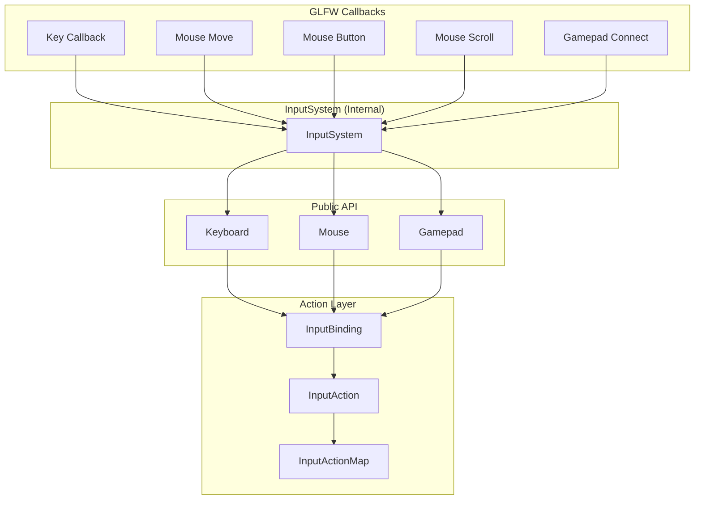
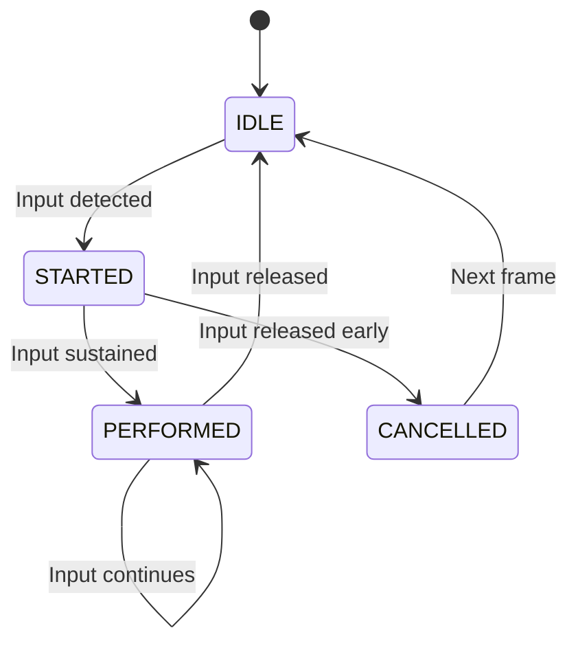

# 5. Input System

The input system provides three layers: raw state queries, device abstractions, and action-based mapping.

## Architecture



## Raw Device Queries

### Keyboard

`Keyboard` (`core/src/main/java/hu/mudlee/core/input/Keyboard.java`):

```java
// Is the key currently held down?
if (Keyboard.isDown(Keys.W)) { moveForward(); }

// Was the key just pressed this frame?
if (Keyboard.isPressed(Keys.SPACE)) { jump(); }

// Get full state snapshot
KeyboardState state = Keyboard.getState();
```

### Mouse

`Mouse` (`core/src/main/java/hu/mudlee/core/input/Mouse.java`):

```java
// Current position
Vector2f pos = Mouse.getPosition();

// Frame-to-frame movement delta
Vector2f delta = Mouse.getDelta();

// Scroll wheel
float scroll = Mouse.getScroll();

// Button state
if (Mouse.isDown(MouseButton.LEFT)) { shoot(); }
if (Mouse.isPressed(MouseButton.RIGHT)) { aim(); }
```

### Gamepad

`Gamepad` (`core/src/main/java/hu/mudlee/core/input/Gamepad.java`):

```java
if (Gamepad.isConnected()) {
    // Buttons
    if (Gamepad.isDown(GamepadButton.A)) { jump(); }

    // Analog sticks (-1.0 to 1.0)
    float moveX = Gamepad.getAxis(GamepadAxis.LEFT_X);
    float moveY = Gamepad.getAxis(GamepadAxis.LEFT_Y);

    // Triggers (0.0 to 1.0)
    float brake = Gamepad.getAxis(GamepadAxis.LT);
}
```

## Action-Based Input

For more complex input handling, the engine provides an action mapping system that decouples game logic from specific keys/buttons.

### Key Types

| Type | File | Description |
|------|------|-------------|
| `InputAction` | `input/InputAction.java` | Named action with bindings and state machine |
| `InputBinding` | `input/InputBinding.java` | Binds a physical input to an action |
| `InputActionMap` | `input/InputActionMap.java` | Named collection of actions |
| `InputActionContext` | `input/InputActionContext.java` | Runtime evaluation context |
| `ActionPhase` | `input/ActionPhase.java` | IDLE → STARTED → PERFORMED → CANCELLED |
| `ActionType` | `input/ActionType.java` | BUTTON, FLOAT, or VECTOR2 |

### Action Lifecycle



### Example: Action Map Setup

```java
var moveAction = new InputAction("Move", ActionType.VECTOR2);
moveAction.addBinding(new CompositeBinding(Keys.W, Keys.S, Keys.A, Keys.D));
moveAction.addBinding(new GamepadAxisBinding(GamepadAxis.LEFT_X, GamepadAxis.LEFT_Y));

var attackAction = new InputAction("Attack", ActionType.BUTTON);
attackAction.addBinding(new KeyBinding(Keys.SPACE));
attackAction.addBinding(new GamepadButtonBinding(GamepadButton.A));

var actionMap = new InputActionMap("Gameplay");
actionMap.addAction(moveAction);
actionMap.addAction(attackAction);
```

## Input State Types

| State | File | Fields |
|-------|------|--------|
| `KeyboardState` | `input/KeyboardState.java` | Per-key pressed/down state |
| `MouseState` | `input/MouseState.java` | Position, delta, scroll, button states |
| `GamepadState` | `input/GamepadState.java` | Button states, axis values |

## Keys Enum

`Keys` (`core/src/main/java/hu/mudlee/core/input/Keys.java`) maps all GLFW key constants to a typed Java enum: `A`-`Z`, `F1`-`F12`, `SPACE`, `ESCAPE`, `LEFT_SHIFT`, `LEFT_CONTROL`, arrow keys, etc.

## Update Order

Each frame, input is updated in this order:

1. `InputSystem.update()` — Poll gamepad state, reset scroll delta, advance action state machines
2. `Window.pollEvents()` — GLFW dispatches buffered keyboard/mouse events to `InputSystem` callbacks
3. Game code reads `Keyboard`, `Mouse`, `Gamepad`, or action states
