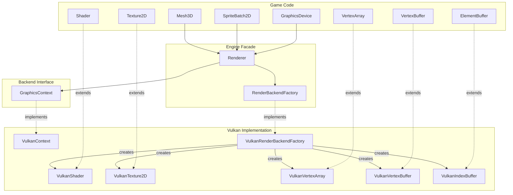
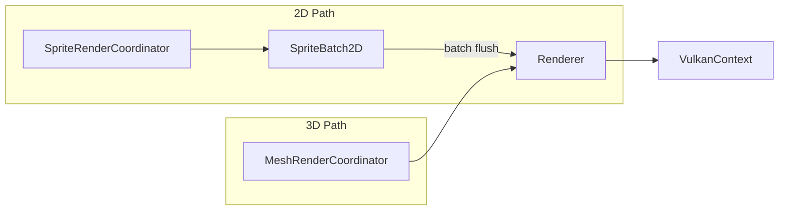

# 6. Rendering Architecture

## Overview

The rendering system is designed as a **Hardware Abstraction Layer (HAL)** that hides Vulkan behind portable interfaces. Game code interacts only with abstract types — the backend can be swapped without changing game logic.

## Layer Diagram



## Renderer

`Renderer` (`core/src/main/java/hu/mudlee/core/render/Renderer.java`) is the singleton facade. It delegates all operations to the active `GraphicsContext`.

### Key Responsibilities

| Method | Description |
|--------|-------------|
| `configure(RenderBackend)` | Select backend (called once before first use) |
| `beginFrame()` | Start frame recording |
| `beginRenderPass()` / `endRenderPass()` | Explicit render pass boundaries |
| `renderRaw(VertexArray, Shader)` | Submit a draw call |
| `present(float)` | Submit command buffer and present |
| `setClearColor(Vector4f)` | Set the frame clear color |
| `waitForGPU()` | Block until GPU is idle |
| `dispose()` | Clean up all GPU resources |

### Telemetry

The Renderer tracks per-frame stats:

| Counter | Description |
|---------|-------------|
| `drawCallCount` | Number of draw calls this frame |
| `vertexCount` | Total vertices submitted |
| `textureCount` | Unique textures bound |
| `spriteBatchFlushCount` | SpriteBatch flush operations |

These are displayed by the `DebugStatsComponent` in the UI overlay.

## GraphicsContext

`GraphicsContext` (`core/src/main/java/hu/mudlee/core/render/GraphicsContext.java`) is the backend interface:

```java
public interface GraphicsContext {
    void windowPrepared();              // Set GLFW hints
    void windowCreated();               // Create GPU resources
    void windowResized();               // Handle resize

    void beginFrame();                  // Start frame
    void present(float frameTime);      // Submit and present

    void beginRenderPass(RenderPassOptions options);
    void beginRenderPass(RenderTarget target, RenderPassOptions options);
    void endRenderPass();

    void renderRaw(VertexArray vao, Shader shader);
    void renderRaw(VertexArray vao, Shader shader, Texture2D texture);
    // ... more overloads

    void setClearColor(Vector4f color);
    void waitIdle();
    String getRendererInfo();
    void dispose();
}
```

Currently, `VulkanContext` is the only implementation.

## RenderBackendFactory

`RenderBackendFactory` (`core/src/main/java/hu/mudlee/core/render/RenderBackendFactory.java`) creates backend-specific objects:

```java
public interface RenderBackendFactory {
    GraphicsContext createGraphicsContext();
    VertexArray createVertexArray();
    VertexBuffer createVertexBuffer(float[] data, VertexBufferLayout layout);
    VertexBuffer createDynamicVertexBuffer(int maxBytes, VertexBufferLayout layout);
    ElementBuffer createElementBuffer(int[] indices, IndexType type);
    Shader createShader(String vertPath, String fragPath);
    Shader createShader(String vertPath, String fragPath, ShaderConfig config);
    Texture2D createTexture(String path);
    Texture2D createTextureFromPixels(int w, int h, ByteBuffer rgba);
    RenderTarget createRenderTarget(int w, int h);
}
```

Game code uses the abstract `create()` static methods on each type (e.g., `Shader.create()`, `Texture2D.create()`), which internally delegate to the factory.

## Abstract Resource Types

All GPU resources extend abstract base classes:

| Abstract Type | Vulkan Implementation | Purpose |
|---------------|----------------------|---------|
| `Shader` | `VulkanShader` | Shader programs + pipeline |
| `Texture2D` | `VulkanTexture2D` | 2D textures |
| `VertexArray` | `VulkanVertexArray` | Vertex format binding |
| `VertexBuffer` | `VulkanVertexBuffer` | Vertex data on GPU |
| `ElementBuffer` | `VulkanIndexBuffer` | Index data on GPU |
| `RenderTarget` | `VulkanRenderTarget` | Off-screen surface |

All implement `Disposable` and must be explicitly cleaned up.

## Render Pass System

Render passes are explicit in this engine (matching Vulkan's model):

```java
graphicsDevice.beginFrame(Color.BLACK);

// Pass 1: Render scene to offscreen target
renderer.beginRenderPass(offscreenTarget, RenderPassOptions.clearColor());
renderer.renderRaw(sceneVao, sceneShader, sceneTexture);
renderer.endRenderPass();

// Pass 2: Render to screen
renderer.beginRenderPass(RenderPassOptions.clearColor());
renderer.renderRaw(fullscreenQuad, postProcessShader, offscreenTarget.getColorTexture());
renderer.endRenderPass();

graphicsDevice.present(dt);
```

### RenderPassOptions

| Factory | Color Load | Description |
|---------|-----------|-------------|
| `clearColor()` | CLEAR | Clears the target with the set clear color |
| `loadColor()` | LOAD | Preserves existing content |

## Render Coordinators

Two coordinator classes simplify common rendering patterns:

### SpriteRenderCoordinator
Manages the active `SpriteBatch2D` instance and delegates sprite draw calls.

### MeshRenderCoordinator
Manages 3D mesh rendering, batching draw calls through the `Renderer`.


