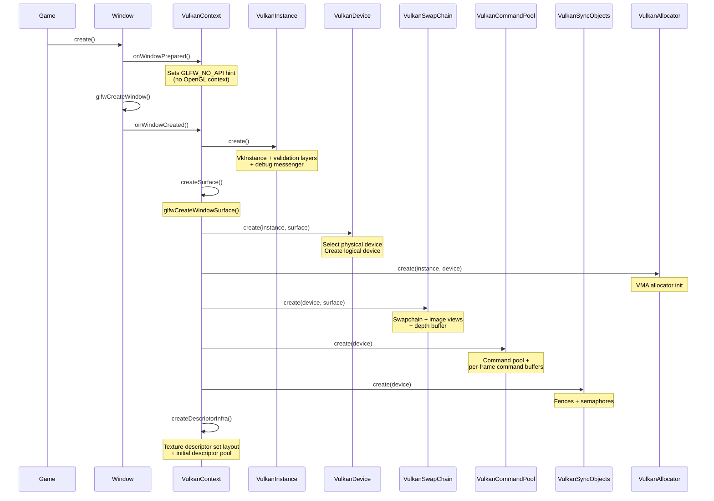

# 7. Vulkan Backend Deep Dive

This chapter covers the Vulkan implementation: how the engine initializes Vulkan, selects a GPU, creates the swapchain, and manages command buffers.

## Initialization Sequence



## VulkanInstance

`VulkanInstance` (`core/src/main/java/hu/mudlee/core/render/vulkan/VulkanInstance.java`)

Creates the `VkInstance` — the entry point to the Vulkan API.

### What It Does

1. **Queries GLFW extensions** — `glfwGetRequiredInstanceExtensions()` returns the extensions needed for surface creation
2. **Adds debug extension** — `VK_EXT_debug_utils` if validation layers are enabled
3. **Creates VkInstance** — with application info and enabled extensions
4. **Sets up debug messenger** — Callback that routes Vulkan validation messages to SLF4J logging

### Validation Layers

When enabled (debug builds), the `VK_LAYER_KHRONOS_validation` layer catches:
- Invalid API usage
- Memory leaks
- Synchronization errors
- Shader compilation issues

The debug callback filters by severity:

| Severity | Action |
|----------|--------|
| ERROR | `LOG.error()` |
| WARNING | `LOG.warn()` |
| INFO | `LOG.info()` |
| VERBOSE | Ignored |

## VulkanDevice

`VulkanDevice` (`core/src/main/java/hu/mudlee/core/render/vulkan/VulkanDevice.java`)

Selects a physical GPU and creates a logical device with the required queues and extensions.

### Physical Device Selection

The engine scores GPUs:

```
Score = VRAM (MB) + GPU type bonus
  - Discrete GPU:   +10000
  - Integrated GPU:  +1000
  - Virtual GPU:      +100
  - Other:              +0
```

The highest-scoring device wins.

### Queue Families

Two queue families are discovered:

| Queue | Purpose |
|-------|---------|
| **Graphics** | Draw commands, transfers |
| **Present** | Swapchain presentation |

These may be the same family (common on desktop GPUs) or different.

### Required Extensions

| Extension | Purpose |
|-----------|---------|
| `VK_KHR_swapchain` | Presentation to window surface |
| `VK_KHR_portability_subset` | macOS/MoltenVK compatibility (auto-detected) |

### Key Methods

| Method | Description |
|--------|-------------|
| `physicalDevice()` | The selected VkPhysicalDevice |
| `logicalDevice()` | The created VkDevice |
| `graphicsQueue()` | Queue for draw commands |
| `presentQueue()` | Queue for presentation |
| `graphicsQueueFamily()` | Index of graphics queue family |
| `findSupportedFormat()` | Find a supported depth/stencil format |

## VulkanSwapChain

`VulkanSwapChain` (`core/src/main/java/hu/mudlee/core/render/vulkan/VulkanSwapChain.java`)

The swapchain is the bridge between Vulkan and the window surface. It manages a set of images that are presented to the screen.

### Swapchain Configuration


| Parameter | Choice |
|-----------|--------|
| **Format** | `VK_FORMAT_B8G8R8A8_SRGB` with `VK_COLOR_SPACE_SRGB_NONLINEAR_KHR` |
| **Present Mode** | `VK_PRESENT_MODE_FIFO_KHR` (vsync) or `VK_PRESENT_MODE_MAILBOX_KHR` |
| **Image Count** | `minImageCount + 1` (usually 3 for triple buffering) |
| **Extent** | Window framebuffer size |

### Depth Buffer

A single shared depth image is created for all swapchain images:

| Property | Value |
|----------|-------|
| Format | `VK_FORMAT_D32_SFLOAT` |
| Usage | `VK_IMAGE_USAGE_DEPTH_STENCIL_ATTACHMENT_BIT` |
| Allocation | VMA device-local memory |

### Framebuffers

Framebuffers are created lazily and cached per `VulkanRenderPassSpec`. Each framebuffer binds:
- Color attachment: swapchain image view
- Depth attachment: shared depth image view

### Resize Handling

On window resize:
1. `vkDeviceWaitIdle()` — Wait for GPU
2. Destroy old swapchain, image views, depth buffer, framebuffers
3. Recreate everything with new dimensions

## VulkanCommandPool

`VulkanCommandPool` (`core/src/main/java/hu/mudlee/core/render/vulkan/VulkanCommandPool.java`)

Manages a pool of command buffers.

### Structure

```
VulkanCommandPool
├── VkCommandPool (one pool)
├── commandBuffers[0]  ← Frame 0
└── commandBuffers[1]  ← Frame 1
```

`FRAMES_IN_FLIGHT = 2` means there are always two command buffers. While the GPU executes frame N, the CPU records frame N+1.

### Single-Use Commands

For one-time operations (buffer uploads, image transitions):

```java
try (var stack = MemoryStack.stackPush()) {
    var cmd = commandPool.beginSingleUse(stack);
    // Record commands...
    commandPool.endSingleUse(cmd, graphicsQueue);
}
```

This creates a temporary command buffer, records commands, submits, and waits for completion.

## VulkanAllocator

`VulkanAllocator` (`core/src/main/java/hu/mudlee/core/render/vulkan/VulkanAllocator.java`)

Wraps the **Vulkan Memory Allocator (VMA)** library. VMA sub-allocates from large memory blocks, reducing the number of `vkAllocateMemory` calls (which are expensive and limited per device).

### Why VMA?

Without VMA, each buffer/image needs its own `vkAllocateMemory` call. Vulkan guarantees at most 4096 allocations on many devices. VMA solves this by:

1. Allocating large blocks (e.g., 256 MB) from the GPU
2. Sub-allocating individual buffers from those blocks
3. Handling alignment, memory type selection, and defragmentation

### Usage in Engine

Every `VulkanBuffer`, `VulkanTexture2D`, and depth image allocation goes through VMA.
