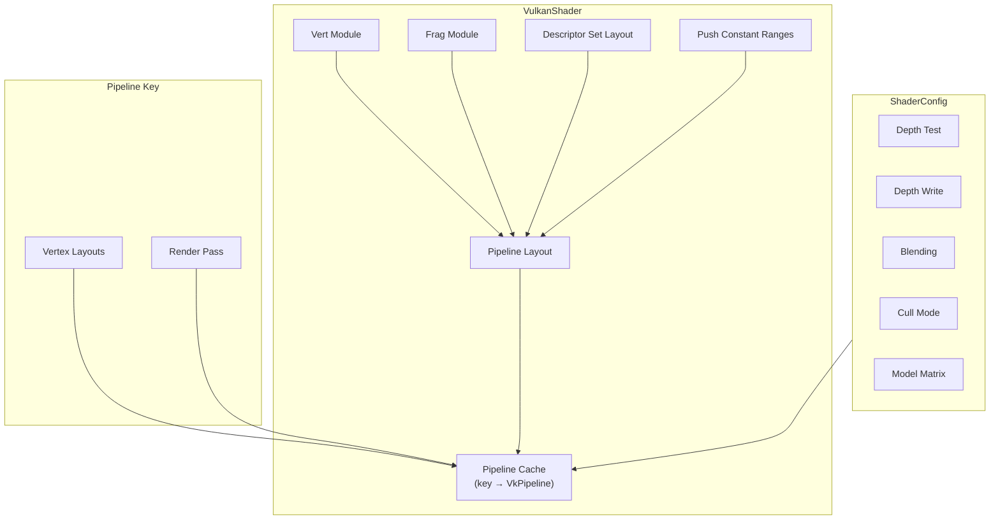
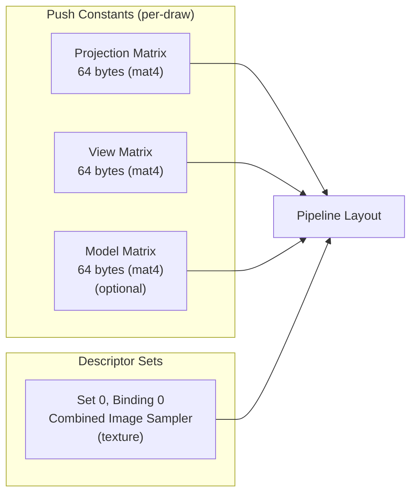
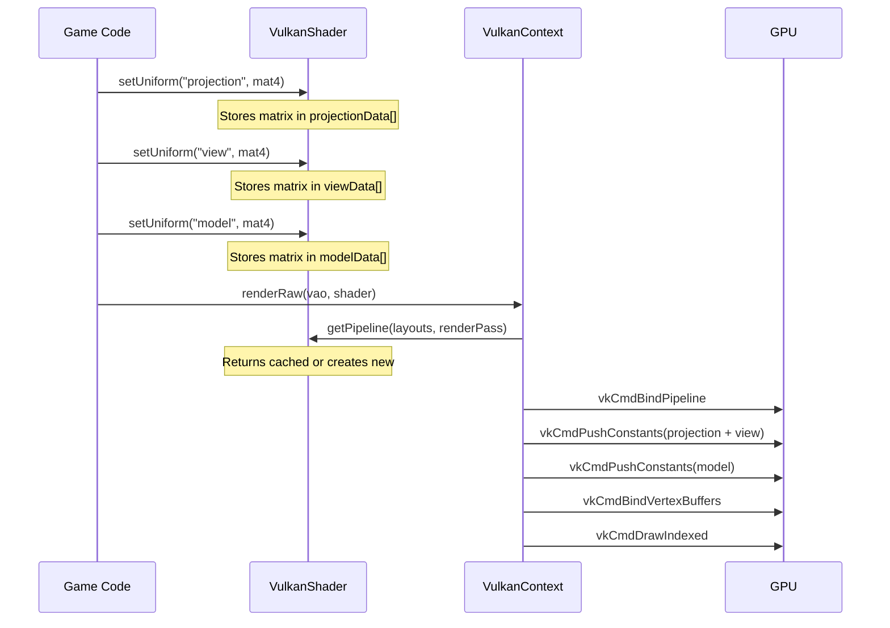
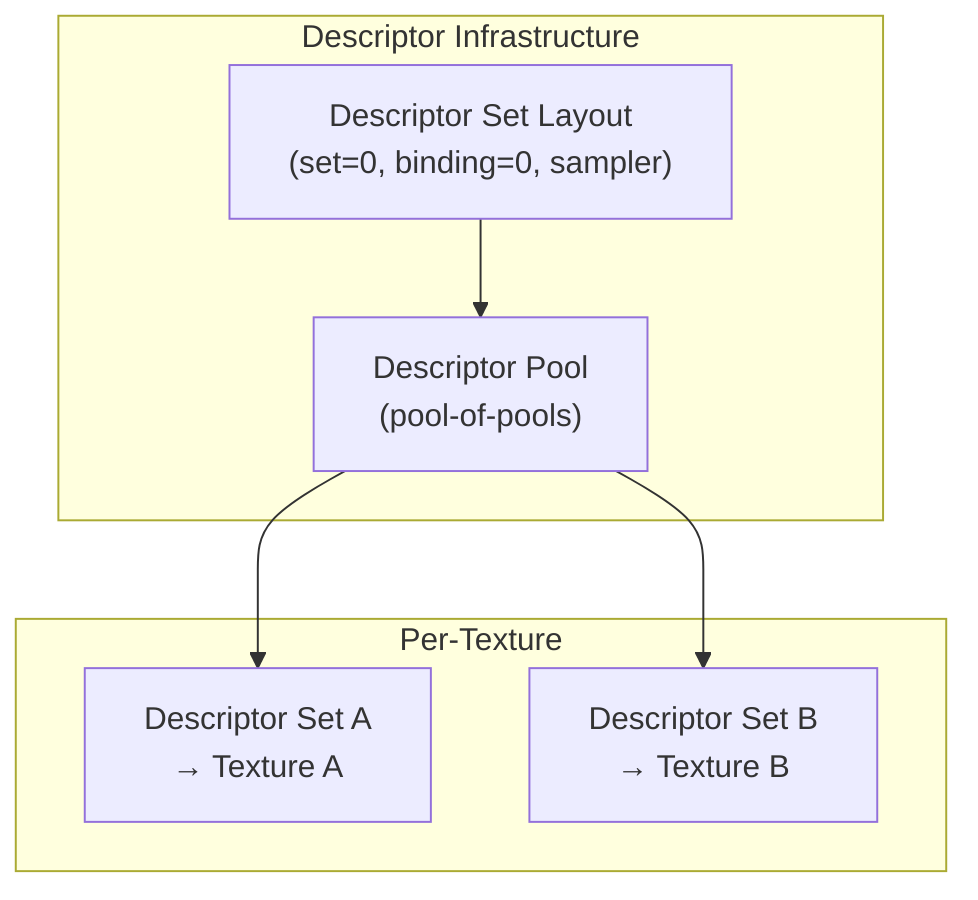

# 8. Vulkan Pipeline & Shaders

## Overview

In Vulkan, a **graphics pipeline** is an immutable object that defines the entire rendering state: shaders, vertex format, blending, depth testing, rasterization, and more. Unlike OpenGL where you set state incrementally, Vulkan requires you to create pipeline objects up front.

This engine uses **deferred pipeline creation** — pipelines are created lazily on the first draw call that needs them, then cached for reuse.

## Pipeline Architecture



## VulkanShader

`VulkanShader` (`core/src/main/java/hu/mudlee/core/render/vulkan/VulkanShader.java`) manages shader modules, pipeline layout, and cached pipelines.

### Shader Loading

1. GLSL source file paths are provided (e.g., `vulkan/3d/vert.glsl`)
2. The engine looks for a pre-compiled `.spv` file at the same path with `.spv` extension
3. If no `.spv` exists, it compiles GLSL → SPIR-V at runtime using **shaderc**
4. SPIR-V bytecode is loaded into `VkShaderModule` objects

### Pipeline Layout

The pipeline layout defines how data is passed to shaders:



### Push Constants

Push constants are the fastest way to pass small amounts of data to shaders. This engine passes **matrices** as push constants:

| Range | Size | Stage | Content |
|-------|------|-------|---------|
| Offset 0 | 128 bytes | Vertex | Projection (64B) + View (64B) |
| Offset 128 | 64 bytes | Vertex | Model matrix (optional, if `usesModelMatrix=true`) |

Total: 128 or 192 bytes per draw call (well within Vulkan's minimum guarantee of 128 bytes for vertex stage).

### Pipeline Caching

Pipelines are cached by a composite key:

```java
record PipelineKey(
    List<VertexBufferLayout> vertexLayouts,
    long renderPassHandle
)
```

This means the same shader can be used with different vertex formats or render targets, each getting its own cached pipeline.

### Pipeline Creation Details

When a new pipeline is needed, `VulkanShader` creates it with:

| Pipeline Stage | Configuration |
|----------------|---------------|
| **Vertex Input** | Derived from `VertexBufferLayout` (bindings + attributes) |
| **Input Assembly** | Triangle list topology |
| **Viewport/Scissor** | Dynamic state (set per draw) |
| **Rasterizer** | Fill mode, configurable cull mode, CCW front face |
| **Multisampling** | Disabled (1 sample) |
| **Depth/Stencil** | Configurable via `ShaderConfig` |
| **Color Blending** | Configurable (alpha blend for 2D, opaque for 3D) |
| **Dynamic State** | Viewport + Scissor |

## ShaderConfig

`ShaderConfig` (`core/src/main/java/hu/mudlee/core/render/types/ShaderConfig.java`) configures pipeline behavior:

```java
public record ShaderConfig(
    boolean depthTestEnabled,
    boolean depthWriteEnabled,
    boolean blendingEnabled,
    boolean usesModelMatrix,
    ShaderCullMode cullMode
)
```

### Preset Configurations

| Preset | Depth Test | Depth Write | Blending | Model Matrix | Cull Mode |
|--------|-----------|-------------|----------|-------------|-----------|
| `default2D()` | OFF | OFF | ON | OFF | NONE |
| `default3D()` | ON | ON | OFF | ON | BACK |

The engine can also auto-detect the preset from the shader path — if the path contains `/3d/`, it uses `default3D()`.

## Shader Uniform Flow



## Vertex Input Mapping

The vertex layout is defined in Java and automatically mapped to Vulkan's `VkVertexInputBindingDescription` and `VkVertexInputAttributeDescription`:

### 2D Sprite Vertex (36 bytes)

| Location | Attribute | Type | Offset |
|----------|-----------|------|--------|
| 0 | Position | vec3 (12B) | 0 |
| 1 | Color | vec4 (16B) | 12 |
| 2 | TexCoords | vec2 (8B) | 28 |

### 3D Colored Vertex (28 bytes)

| Location | Attribute | Type | Offset |
|----------|-----------|------|--------|
| 0 | Position | vec3 (12B) | 0 |
| 1 | Color | vec4 (16B) | 12 |

## Descriptor Sets

Textures are bound via Vulkan descriptor sets:



Each `VulkanTexture2D` gets a pre-allocated descriptor set that points to its image/sampler. During rendering, the descriptor set is bound with `vkCmdBindDescriptorSets`.

### Pool-of-Pools Pattern

Vulkan descriptor pools have a fixed capacity. When one fills up, the engine allocates a new pool:

```
DescriptorPool 1 [full: 64/64 sets]
DescriptorPool 2 [partial: 30/64 sets]
DescriptorPool 3 [empty: 0/64 sets]
```

Freed descriptor sets are returned to their pool for reuse.

## ShaderProps Constants

`ShaderProps` (`core/src/main/java/hu/mudlee/core/render/types/ShaderProps.java`) defines uniform name constants:

| Constant | Value | Usage |
|----------|-------|-------|
| `UNIFORM_PROJECTION_MATRIX` | `"projection"` | Camera projection |
| `UNIFORM_VIEW_MATRIX` | `"view"` | Camera view transform |
| `UNIFORM_MODEL_MATRIX` | `"model"` | Object world transform |
| `UNIFORM_COLOR` | `"color"` | Flat color |
| `UNIFORM_TEXTURE` | `"texture"` | Texture sampler |
