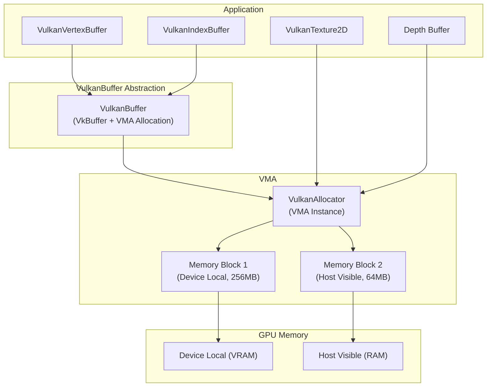
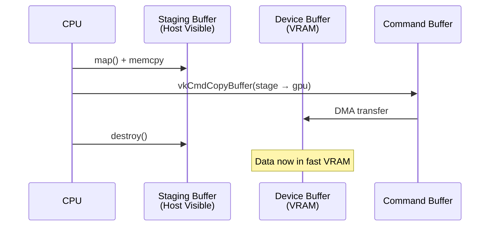
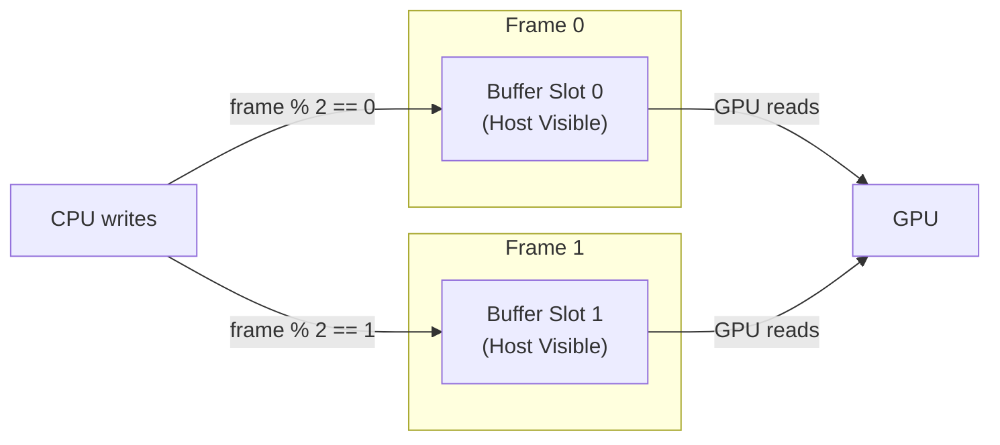
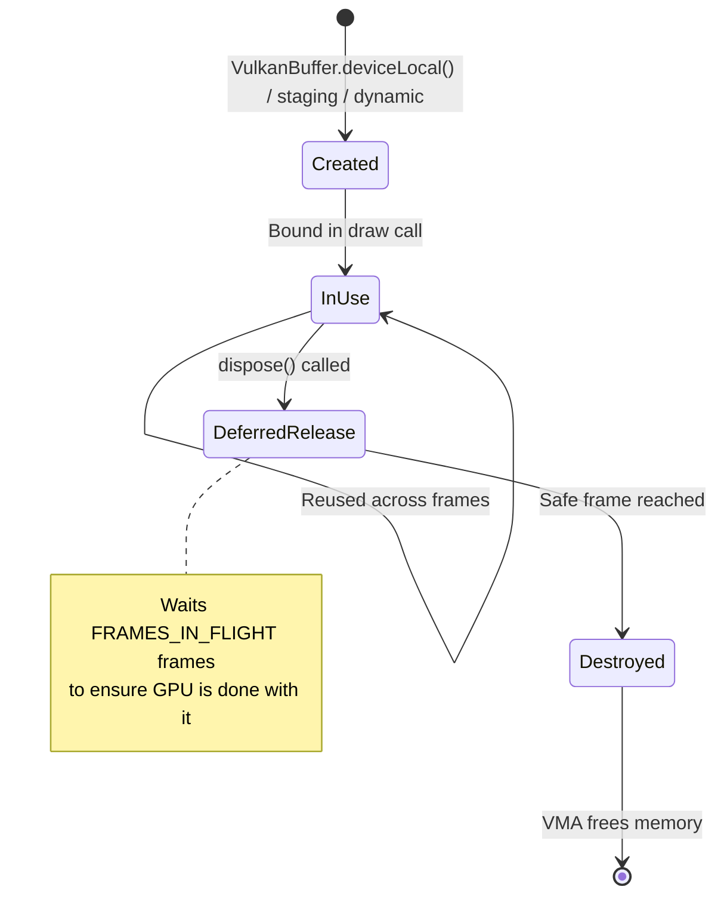

# 9. Vulkan Memory & Buffers

## Memory Architecture

Vulkan gives you explicit control over GPU memory. The engine uses **VMA (Vulkan Memory Allocator)** to manage this complexity.



## VulkanBuffer

`VulkanBuffer` (`core/src/main/java/hu/mudlee/core/render/vulkan/VulkanBuffer.java`) is the low-level buffer abstraction. Each buffer is a `VkBuffer` handle paired with a VMA allocation.

### Allocation Strategies

| Strategy | Memory Type | Usage | When to Use |
|----------|------------|-------|-------------|
| `deviceLocal()` | GPU VRAM | Fastest GPU access | Static geometry, textures |
| `stagingUpload()` | Host-visible | Transfer source | Temporary upload buffer |
| `dynamicUpload()` | Host-visible, coherent | Sequential write | Per-frame updates (SpriteBatch) |

### Static Upload Path

For data that doesn't change (meshes, static vertex buffers):



1. Create a staging buffer (host-visible)
2. Map it and copy CPU data into it
3. Record a `vkCmdCopyBuffer` command to transfer to device-local memory
4. Execute via single-use command buffer
5. Destroy the staging buffer

### Dynamic Upload Path

For data that changes every frame (SpriteBatch vertices):



Dynamic buffers use **host-visible, host-coherent** memory. There's one buffer per frame-in-flight slot, so the CPU can write to slot N while the GPU reads from slot N-1.

## VulkanVertexBuffer

`VulkanVertexBuffer` (`core/src/main/java/hu/mudlee/core/render/vulkan/VulkanVertexBuffer.java`) extends the abstract `VertexBuffer`.

### Static Mode

```java
// Created once, uploaded via staging buffer
var vbo = VertexBuffer.create(vertexData, layout);
```

- Single device-local `VulkanBuffer`
- Uploaded at creation time
- Cannot be updated after creation

### Dynamic Mode

```java
// Created with max capacity, updated every frame
var vbo = VertexBuffer.createDynamic(maxBytes, layout);

// Each frame:
vbo.update(newVertexData, floatCount);
```

- `FRAMES_IN_FLIGHT` host-visible buffers (one per frame slot)
- `update()` writes to the current frame's buffer
- `bufferHandle()` returns the active buffer for the current frame

### Vertex Layout

`VertexBufferLayout` (`core/src/main/java/hu/mudlee/core/render/VertexBufferLayout.java`) describes the vertex format:

```java
var layout = new VertexBufferLayout(
    VertexInputRate.PER_VERTEX,
    new VertexLayoutAttribute(0, 3, ShaderTypes.FLOAT, false, 36, 0),   // position
    new VertexLayoutAttribute(1, 4, ShaderTypes.FLOAT, false, 36, 12),  // color
    new VertexLayoutAttribute(2, 2, ShaderTypes.FLOAT, false, 36, 28)   // texcoords
);
```

| Field | Description |
|-------|-------------|
| `inputRate` | `PER_VERTEX` or `PER_INSTANCE` |
| `location` | Shader input location |
| `componentCount` | Number of components (2=vec2, 3=vec3, 4=vec4) |
| `shaderType` | Data type (FLOAT, INT) |
| `normalized` | Whether to normalize integer data |
| `stride` | Bytes between consecutive vertices |
| `offset` | Byte offset of this attribute within the vertex |

## VulkanIndexBuffer

`VulkanIndexBuffer` (`core/src/main/java/hu/mudlee/core/render/vulkan/VulkanIndexBuffer.java`) extends `ElementBuffer`.

- Always uses device-local memory (uploaded via staging)
- Index type: `VK_INDEX_TYPE_UINT32` (32-bit indices)
- Created with `ElementBuffer.create(int[] indices, IndexType type)`

## VulkanVertexArray

`VulkanVertexArray` (`core/src/main/java/hu/mudlee/core/render/vulkan/VulkanVertexArray.java`) extends `VertexArray`.

In Vulkan, there's no actual "vertex array object" like OpenGL's VAO. `VulkanVertexArray` is a lightweight container that groups:

- One or more `VertexBuffer` instances (VBOs)
- Optional `ElementBuffer` (index buffer)
- Instance count (for instanced rendering)

During `renderRaw()`, the context reads these to bind the correct buffers and issue the draw call.

```java
var vao = VertexArray.create();
vao.addVBO(vertexBuffer);
vao.setEBO(indexBuffer);
// vao.setInstanceCount(100); // for instanced rendering
```

## Memory Lifecycle



All buffer disposal is deferred (see [Vulkan Synchronization](10-vulkan-synchronization.md)) to ensure the GPU is done reading the buffer before its memory is freed.
