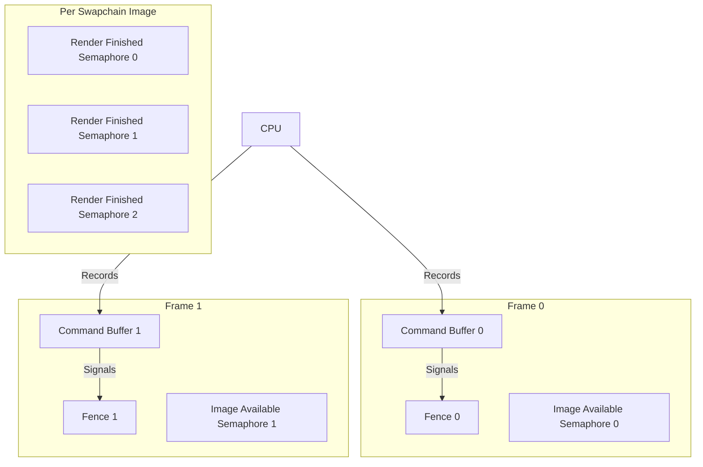
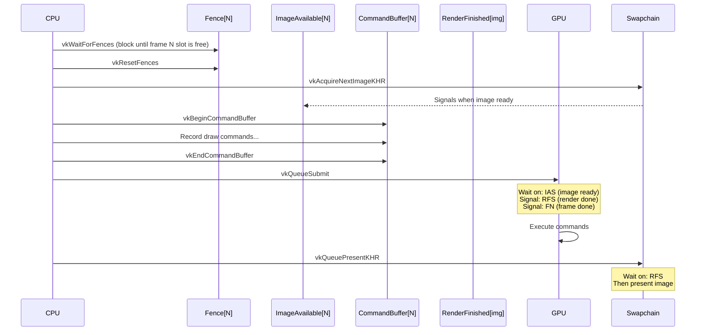
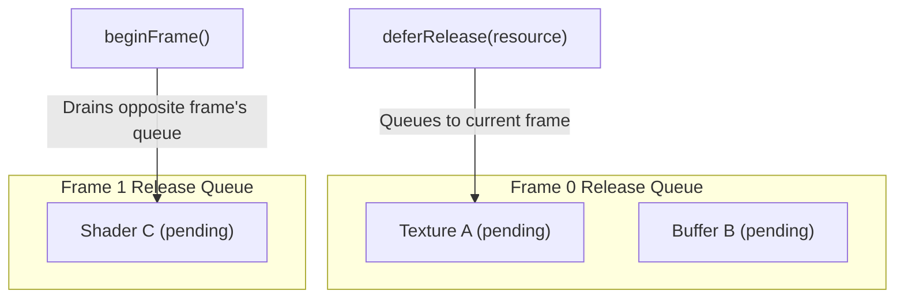
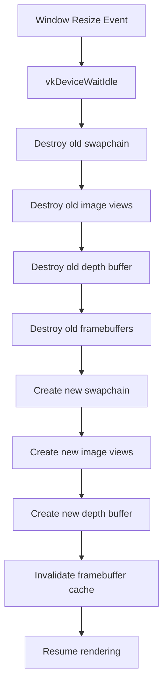

# 10. Vulkan Synchronization

## Why Synchronization Matters

Vulkan gives the application full control over CPU-GPU synchronization. Without proper sync:
- The CPU might overwrite a buffer the GPU is still reading
- The GPU might render to an image before the previous present is done
- Resources might be destroyed while the GPU still references them

## Frames In Flight

The engine uses **double buffering** (`FRAMES_IN_FLIGHT = 2`):



While the GPU executes frame N's commands, the CPU records frame N+1. This keeps both CPU and GPU busy.

## VulkanSyncObjects

`VulkanSyncObjects` (`core/src/main/java/hu/mudlee/core/render/vulkan/VulkanSyncObjects.java`) creates and manages:

| Object | Count | Purpose |
|--------|-------|---------|
| `inFlightFence[i]` | 2 (per frame slot) | CPU waits on this before reusing frame slot i |
| `imageAvailableSemaphore[i]` | 2 (per frame slot) | GPU signals when swapchain image is ready |
| `renderFinishedSemaphore[j]` | Per swapchain image | GPU signals when rendering to image j is done |

## Frame Synchronization Flow



### Step by Step

1. **Wait for fence** — `vkWaitForFences(inFlightFence[currentFrame])` blocks until this frame slot's previous submission is done
2. **Reset fence** — `vkResetFences(inFlightFence[currentFrame])`
3. **Acquire image** — `vkAcquireNextImageKHR` gets the next available swapchain image, signals `imageAvailableSemaphore[currentFrame]`
4. **Record commands** — Fill the command buffer with draw calls
5. **Submit** — `vkQueueSubmit` with:
   - Wait semaphore: `imageAvailableSemaphore[currentFrame]` (don't start until image is ready)
   - Signal semaphore: `renderFinishedSemaphore[imageIndex]` (signal when rendering is done)
   - Signal fence: `inFlightFence[currentFrame]` (signal when GPU is done with this frame slot)
6. **Present** — `vkQueuePresentKHR` waits on `renderFinishedSemaphore[imageIndex]` then displays the image
7. **Advance frame** — `currentFrame = (currentFrame + 1) % FRAMES_IN_FLIGHT`

## Deferred Resource Release

When a GPU resource is disposed (e.g., a texture is deleted), it might still be referenced by an in-flight command buffer. The engine uses **deferred release queues**:



### How It Works

1. When `dispose()` is called on a resource, `VulkanContext.deferRelease(Runnable)` adds the destruction callback to the current frame's queue
2. At the start of each frame (after waiting on the fence), the engine drains the **opposite** frame's release queue
3. Since we waited on that frame's fence, we know the GPU is done with those resources

```
Frame N begins:
  1. Wait for fence[N] (GPU done with frame N's previous work)
  2. Drain releaseQueue[N] (safe to destroy these now)
  3. Record new commands...
  4. Any dispose() calls queue to releaseQueue[N]

Frame N+1 begins:
  1. Wait for fence[N+1]
  2. Drain releaseQueue[N+1]
  ...
```

This ensures resources live for at least one full frame cycle after disposal.

## Swapchain Recreation

When the window is resized, the swapchain must be recreated:



`vkDeviceWaitIdle()` is called to ensure nothing is in flight before destroying swapchain resources.
