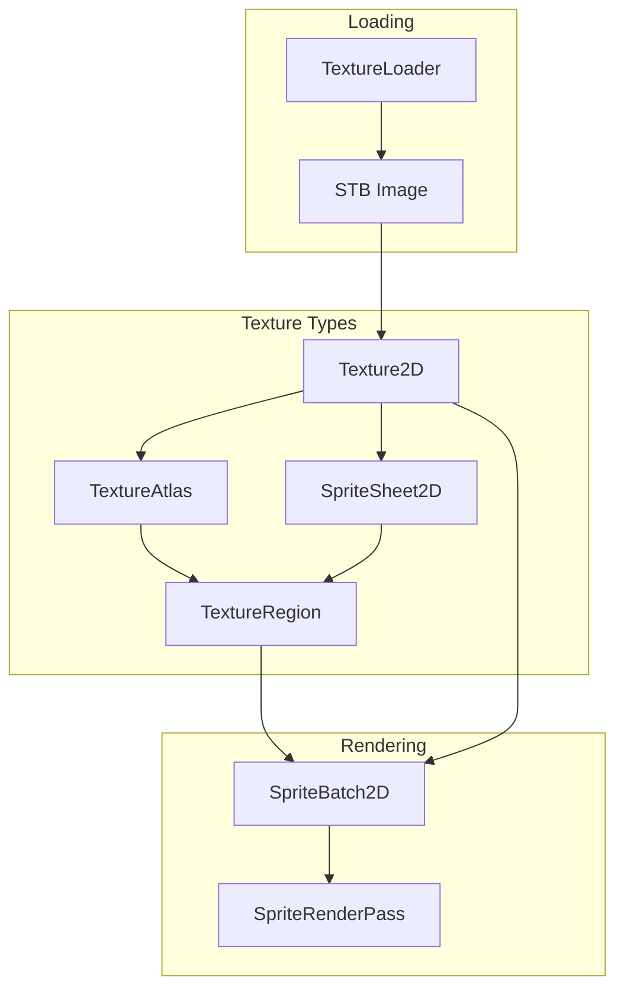
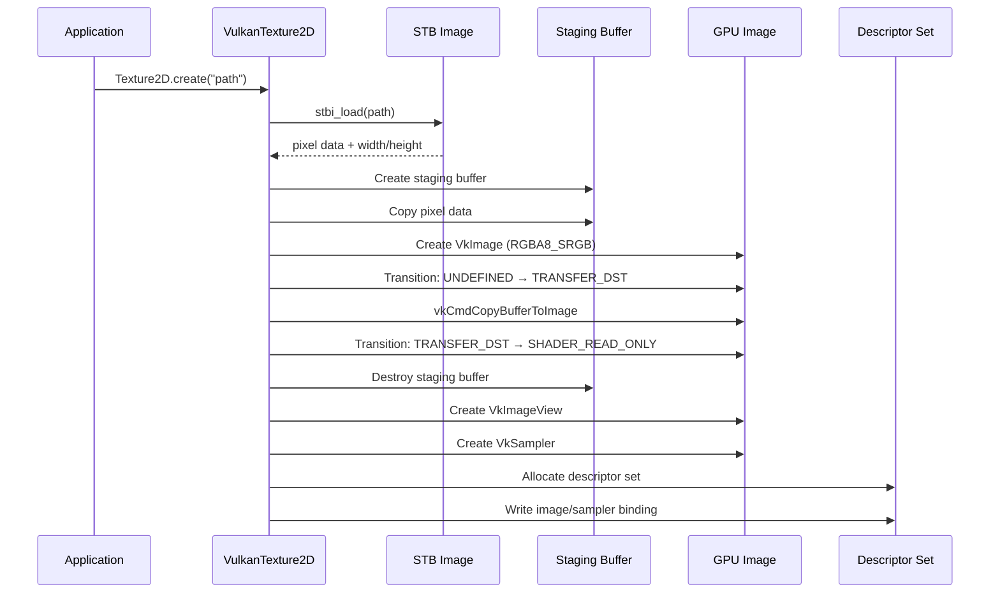
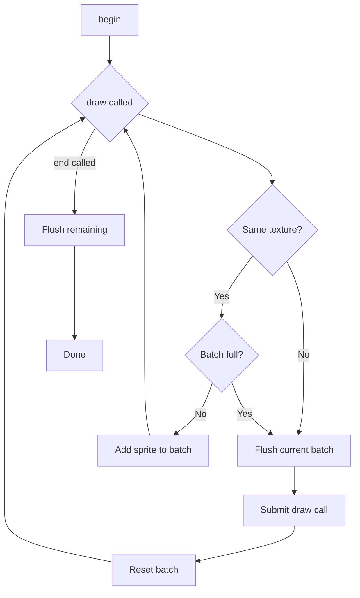

# 11. Textures & Sprites

## Texture System Overview



## Texture2D

`Texture2D` (`core/src/main/java/hu/mudlee/core/render/texture/Texture2D.java`) is the abstract base class for all 2D textures.

### Creating Textures

```java
// From a file (loaded via STB Image)
var texture = Texture2D.create("textures/mario.png");

// From raw pixel data (RGBA8)
var texture = Texture2D.createFromPixels(width, height, rgbaBuffer);
```

### VulkanTexture2D Internal Flow



### Vulkan Texture Properties

| Property | Value |
|----------|-------|
| Format | `VK_FORMAT_R8G8B8A8_SRGB` |
| Tiling | `VK_IMAGE_TILING_OPTIMAL` |
| Usage | `TRANSFER_DST | SAMPLED` |
| Memory | Device-local (VRAM) |
| Sampler Filter | Linear (mag + min) |
| Address Mode | Repeat |

### Descriptor Binding

Each `VulkanTexture2D` owns a pre-allocated descriptor set (from the pool-of-pools). During rendering, `VulkanContext` binds it with:

```
vkCmdBindDescriptorSets(SET_0, texture.descriptorSetHandle())
```

## TextureRegion

`TextureRegion` (`core/src/main/java/hu/mudlee/core/render/texture/TextureRegion.java`) represents a rectangular sub-area of a texture using UV coordinates:

```java
public record TextureRegion(
    Texture2D texture,
    float u0, float v0,   // top-left UV
    float u1, float v1    // bottom-right UV
)
```

## TextureAtlas

`TextureAtlas` (`core/src/main/java/hu/mudlee/core/render/texture/TextureAtlas.java`) maps named regions to texture coordinates within a single texture:

```java
var atlas = TextureAtlas.builder(texture)
    .region("idle", 0, 0, 48, 48)
    .region("walk", 48, 0, 48, 48)
    .build();

TextureRegion idle = atlas.getRegion("idle");
```

Using atlases reduces texture switches (and thus draw call flushes) during sprite batching.

## SpriteSheet2D

`SpriteSheet2D` (`core/src/main/java/hu/mudlee/core/render/texture/SpriteSheet2D.java`) provides grid-based extraction from a single texture:

```java
var sheet = new SpriteSheet2D(texture, spriteWidth, spriteHeight);

// Get region at grid position (column, row)
TextureRegion frame = sheet.getRegion(2, 0);  // 3rd column, 1st row
```

This is used for sprite animation — each grid cell is one animation frame.

## SpriteBatch2D

`SpriteBatch2D` (`core/src/main/java/hu/mudlee/core/render/SpriteBatch2D.java`) batches 2D sprite draw calls to minimize GPU submissions.

### How Batching Works



### Batch Specifications

| Property | Value |
|----------|-------|
| Max sprites per batch | 1000 |
| Vertices per sprite | 4 |
| Indices per sprite | 6 (two triangles) |
| Vertex format | vec3 pos + vec4 color + vec2 uv = 36 bytes |
| Max vertices | 4000 |
| Max indices | 6000 |

### Usage

```java
var spriteBatch = new SpriteBatch2D();

// In draw():
spriteBatch.begin(camera.getProjectionMatrix(), camera.getViewMatrix());

// Draw a textured sprite
spriteBatch.draw(texture, x, y);

// Draw with scale, rotation, color
spriteBatch.draw(textureRegion, x, y, width, height, rotation, color);

// Draw from a texture atlas region
spriteBatch.draw(atlas.getRegion("player"), x, y, 48, 48);

spriteBatch.end();  // Flushes remaining sprites
```

### Internal Vertex Layout

Each sprite generates 4 vertices forming a quad:

```
(0)────(1)
 │ \    │
 │  \   │
 │   \  │
 │    \ │
(3)────(2)

Indices: [0,1,2, 2,3,0]
```

Each vertex contains:
```
float[9] = {
    posX, posY, posZ,      // position (z=0 for 2D)
    r, g, b, a,            // color
    u, v                    // texture coordinates
}
```

### Dynamic Buffer Management

SpriteBatch uses a **dynamic vertex buffer** — one host-visible buffer per frame-in-flight:

```
Frame 0: Write to VBO slot 0, GPU reads VBO slot 1
Frame 1: Write to VBO slot 1, GPU reads VBO slot 0
```

The index buffer is static (pre-filled with the quad index pattern for 1000 sprites).

### Flush Triggers

The batch flushes (submits a draw call) when:
1. `end()` is called
2. A different texture is drawn (texture switch)
3. The batch reaches 1000 sprites

## SpriteRenderCoordinator

`SpriteRenderCoordinator` (`core/src/main/java/hu/mudlee/core/render/SpriteRenderCoordinator.java`) delegates draw calls to the active `SpriteBatch2D`. It implements `SpriteRenderPass` so ECS render systems can draw through it without knowing about batching details.

## TextureData

`TextureData` (`core/src/main/java/hu/mudlee/core/render/texture/TextureData.java`) holds raw pixel data (width, height, ByteBuffer) returned by the texture loader.

## TextureLoader

`TextureLoader` (`core/src/main/java/hu/mudlee/core/render/texture/TextureLoader.java`) uses STB Image to load PNG/JPG/BMP files into raw pixel buffers.
