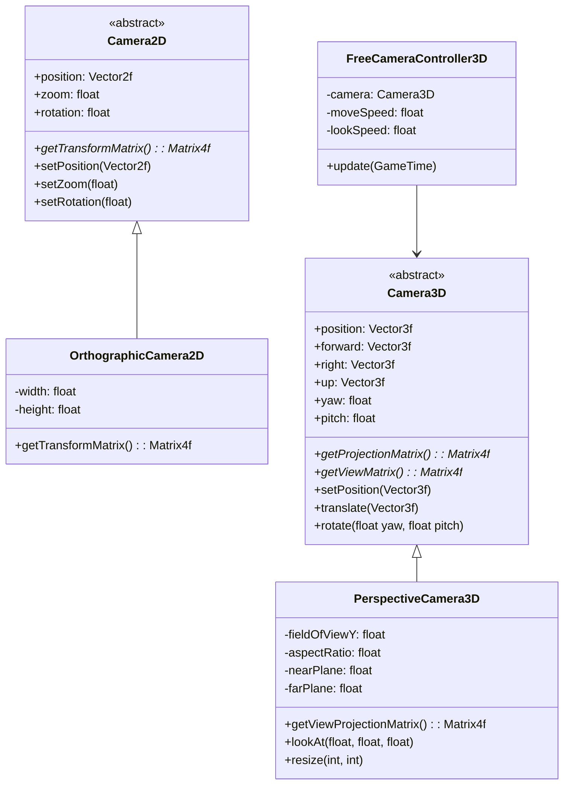
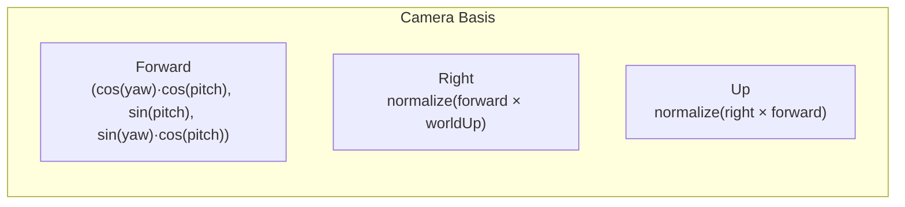
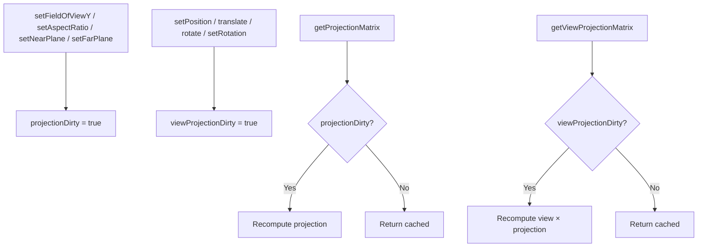
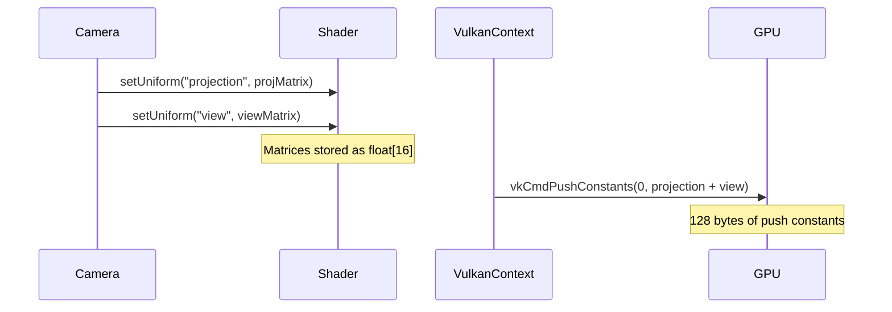

# 12. Cameras

## Camera Hierarchy



## 2D Cameras

### Camera2D (Abstract)

`Camera2D` (`core/src/main/java/hu/mudlee/core/render/camera/Camera2D.java`) is the base class for all 2D cameras.

| Property | Type | Default | Description |
|----------|------|---------|-------------|
| `position` | `Vector2f` | (0, 0) | Camera position in world space |
| `zoom` | `float` | 1.0 | Zoom level (>1 = zoomed in) |
| `rotation` | `float` | 0.0 | Rotation in radians |

Uses a **dirty flag** pattern — the transform matrix is only recomputed when a property changes.

### OrthographicCamera2D

`OrthographicCamera2D` (`core/src/main/java/hu/mudlee/core/render/camera/OrthographicCamera2D.java`) creates an orthographic projection where 1 unit = 1 pixel.

```java
var camera = new OrthographicCamera2D(1920, 1080);
camera.setPosition(new Vector2f(960, 540));  // Center on screen

// In draw:
spriteBatch.begin(camera.getTransformMatrix());
```

The transform matrix combines projection and view:

```
Transform = Projection × View

Projection = ortho(0, width, height, 0, -1, 1)   // Y-down, like screen coords
View       = translate(-position) × rotate(rotation) × scale(zoom)
```

## 3D Cameras

### Camera3D (Abstract)

`Camera3D` (`core/src/main/java/hu/mudlee/core/render/camera/Camera3D.java`) provides a 3D camera with Euler angle rotation.

| Property | Type | Description |
|----------|------|-------------|
| `position` | `Vector3f` | World position |
| `forward` | `Vector3f` | Forward direction (computed from yaw/pitch) |
| `right` | `Vector3f` | Right direction (cross product) |
| `up` | `Vector3f` | Up direction (cross product) |
| `worldUp` | `Vector3f` | World up axis (0, 1, 0) |
| `yaw` | `float` | Horizontal rotation (degrees) |
| `pitch` | `float` | Vertical rotation (degrees, clamped ±89°) |

**Pitch clamping** prevents gimbal lock — looking straight up or down would make the forward and up vectors parallel, breaking the cross product.

### Direction Vectors



### PerspectiveCamera3D

`PerspectiveCamera3D` (`core/src/main/java/hu/mudlee/core/render/camera/PerspectiveCamera3D.java`) adds perspective projection with caching.

| Property | Type | Default | Description |
|----------|------|---------|-------------|
| `fieldOfViewY` | `float` | 45° | Vertical field of view |
| `aspectRatio` | `float` | 16:9 | Width / height ratio |
| `nearPlane` | `float` | 0.1 | Near clipping plane |
| `farPlane` | `float` | 100.0 | Far clipping plane |

```java
var camera = new PerspectiveCamera3D(
    Math.toRadians(45),  // FOV
    1920f / 1080f,       // aspect ratio
    0.1f,                // near
    100f                 // far
);
camera.setPosition(new Vector3f(0, 2, 5));
camera.lookAt(0, 0, 0);
```

### Matrix Caching

PerspectiveCamera3D uses dirty flags to avoid redundant matrix recomputations:



### lookAt()

`lookAt(x, y, z)` calculates the yaw and pitch needed to face a target point:

```
direction = normalize(target - position)
pitch = asin(direction.y)
yaw = atan2(direction.z, direction.x)
```

## FreeCameraController3D

`FreeCameraController3D` (`core/src/main/java/hu/mudlee/core/render/camera/FreeCameraController3D.java`) provides FPS-style camera control:

| Input | Action |
|-------|--------|
| W / Left Stick Up | Move forward |
| S / Left Stick Down | Move backward |
| A / Left Stick Left | Strafe left |
| D / Left Stick Right | Strafe right |
| Space / RB | Rise |
| Ctrl / LB | Descend |
| Shift | Sprint (2x speed) |
| Mouse / Right Stick | Look around |
| Tab | Toggle mouse capture |

```java
var controller = new FreeCameraController3D(camera);

// In update():
controller.update(gameTime);

// In draw():
shader.setUniform("projection", camera.getProjectionMatrix());
shader.setUniform("view", camera.getViewMatrix());
```

## How Cameras Feed Into Shaders



The camera's projection and view matrices are stored in the shader as float arrays, then uploaded as push constants during `renderRaw()`.
