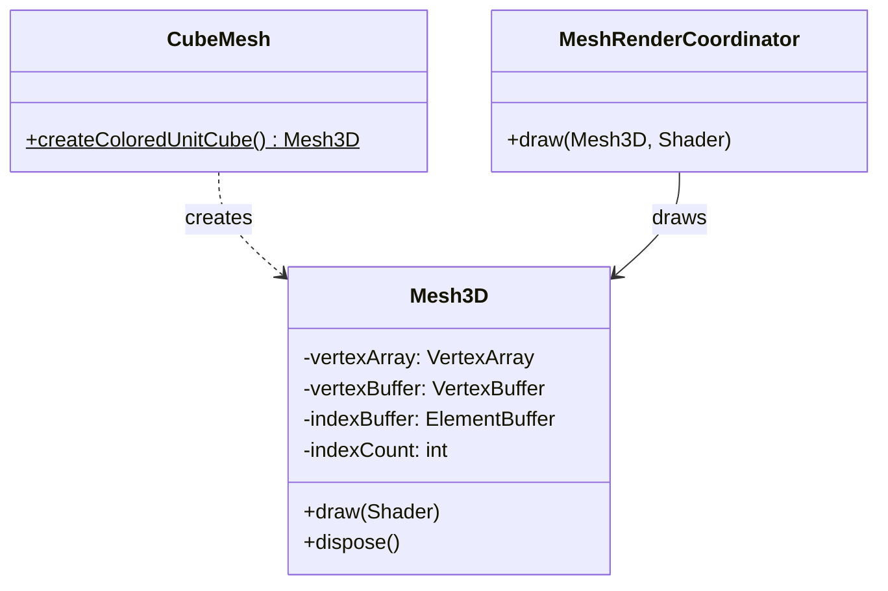

# 13. 3D Mesh System

## Overview

The 3D mesh system provides a simple abstraction for indexed triangle meshes. Currently focused on colored geometry (no textures on 3D meshes yet).

## Class Diagram



## Mesh3D

`Mesh3D` (`core/src/main/java/hu/mudlee/core/render/mesh/Mesh3D.java`) is a container for GPU-resident mesh data:

| Field | Type | Description |
|-------|------|-------------|
| `vertexArray` | `VertexArray` | VAO binding descriptor |
| `vertexBuffer` | `VertexBuffer` | Vertex data on GPU |
| `indexBuffer` | `ElementBuffer` | Index data on GPU |
| `indexCount` | `int` | Number of indices |

### Usage

```java
// Create a mesh
var mesh = CubeMesh.createColoredUnitCube();

// Draw it
mesh.draw(shader);

// Clean up
mesh.dispose();
```

### draw() Internals

`draw()` delegates to `Renderer.renderRaw(vertexArray, shader)`, which in turn calls `VulkanContext.renderRaw()`:

1. Bind or create pipeline (based on vertex layout + render pass)
2. Push constants (projection, view, model matrices)
3. Bind vertex buffer
4. Bind index buffer
5. `vkCmdDrawIndexed(indexCount, 1, 0, 0, 0)`

## CubeMesh

`CubeMesh` (`core/src/main/java/hu/mudlee/core/render/mesh/CubeMesh.java`) generates a unit cube (-0.5 to +0.5 on each axis) with per-face colors.

### Vertex Layout

Each vertex has 7 floats (28 bytes):

```
position (vec3): x, y, z
color    (vec4): r, g, b, a
```

### Cube Data

6 faces × 4 vertices = 24 vertices
6 faces × 2 triangles × 3 indices = 36 indices

| Face | Color |
|------|-------|
| Front (+Z) | Red |
| Back (-Z) | Green |
| Top (+Y) | Blue |
| Bottom (-Y) | Yellow |
| Right (+X) | Magenta |
| Left (-X) | Cyan |

### Winding Order

Triangles use **counter-clockwise** front-face winding (matching Vulkan's default when `VK_FRONT_FACE_COUNTER_CLOCKWISE` is set).

## MeshRenderCoordinator

`MeshRenderCoordinator` (`core/src/main/java/hu/mudlee/core/render/MeshRenderCoordinator.java`) provides a higher-level draw interface that coordinates mesh drawing through the `Renderer`.

## Rendering a 3D Scene

Complete example from the CubeScene:

```java
// Setup (in initialize/loadContent)
var shader = Shader.create("vulkan/3d/vert.glsl", "vulkan/3d/frag.glsl");
var mesh = CubeMesh.createColoredUnitCube();
var camera = new PerspectiveCamera3D(Math.toRadians(45), aspectRatio, 0.1f, 100f);
camera.setPosition(new Vector3f(0, 2, 5));

// Per frame (in draw)
graphicsDevice.beginFrame(Color.BLACK);

// Set camera matrices
shader.setUniform("projection", camera.getProjectionMatrix());
shader.setUniform("view", camera.getViewMatrix());

// Set model matrix (rotating cube)
var model = new Matrix4f()
    .rotateY(angle)
    .rotateX(angle * 0.5f);
shader.setUniform("model", model);

// Draw
meshCoordinator.draw(mesh, shader);

graphicsDevice.present(dt);
```

## Pipeline Configuration for 3D

3D meshes use `ShaderConfig.default3D()`:

| Setting | Value | Why |
|---------|-------|-----|
| Depth test | ON | Objects behind others should be hidden |
| Depth write | ON | Closer objects update the depth buffer |
| Blending | OFF | Opaque geometry |
| Model matrix | ON | Each object has its own world transform |
| Cull mode | BACK | Don't render back faces |
