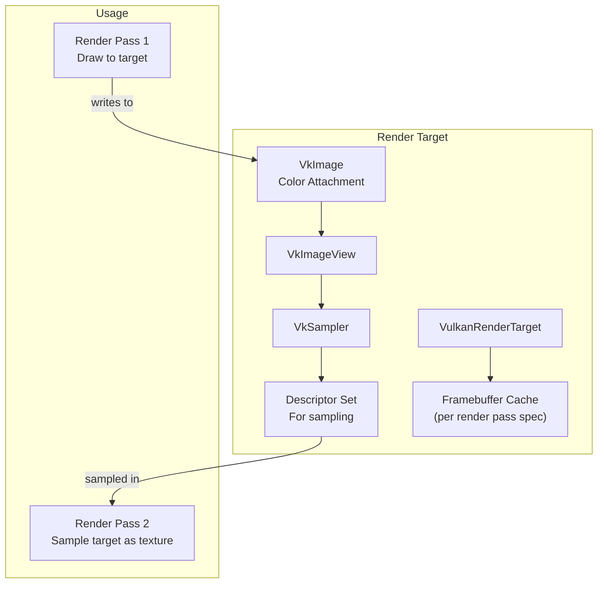
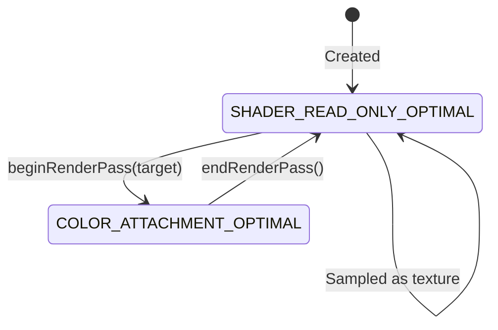
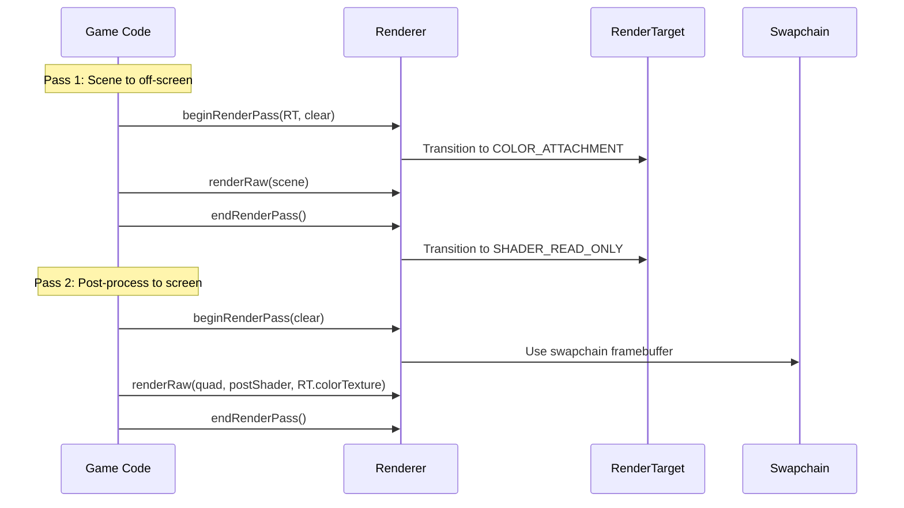

# 14. Render Targets

## What Is a Render Target?

A render target is an off-screen surface you can render to instead of the screen. After rendering, the result can be used as a texture for post-processing, UI overlays, or multi-pass rendering.

## Architecture



## RenderTarget

`RenderTarget` (`core/src/main/java/hu/mudlee/core/render/RenderTarget.java`) is the abstract base class:

```java
// Create an off-screen target
var target = RenderTarget.create(512, 512);

// Render to it
renderer.beginRenderPass(target, RenderPassOptions.clearColor());
renderer.renderRaw(sceneVao, sceneShader, sceneTexture);
renderer.endRenderPass();

// Use result as texture
renderer.beginRenderPass(RenderPassOptions.clearColor());
renderer.renderRaw(fullscreenQuad, postShader, target.getColorTexture());
renderer.endRenderPass();

// Resize if needed
target.resize(newWidth, newHeight);

// Clean up
target.dispose();
```

## VulkanRenderTarget

`VulkanRenderTarget` (`core/src/main/java/hu/mudlee/core/render/vulkan/VulkanRenderTarget.java`) implements the Vulkan-specific off-screen surface.

### Layout Transitions

The render target image transitions between two layouts:



| Layout | When | Purpose |
|--------|------|---------|
| `SHADER_READ_ONLY_OPTIMAL` | Default state | Optimal for texture sampling |
| `COLOR_ATTACHMENT_OPTIMAL` | During render pass | Optimal for writing as color attachment |

### Framebuffer Caching

Each render target caches framebuffers per `VulkanRenderPassSpec` — different render pass configurations (load/clear, depth on/off) get their own framebuffer.

### Resize

`resize(width, height)` destroys and recreates all GPU objects (image, view, sampler, descriptor set, framebuffers) if the dimensions have changed. This is useful for resolution-dependent effects.

## VulkanRenderPass

`VulkanRenderPass` (`core/src/main/java/hu/mudlee/core/render/vulkan/VulkanRenderPass.java`) creates `VkRenderPass` objects from a specification.

## VulkanRenderPassSpec

`VulkanRenderPassSpec` (`core/src/main/java/hu/mudlee/core/render/vulkan/VulkanRenderPassSpec.java`) is an immutable record describing a render pass:

| Field | Description |
|-------|-------------|
| `colorFormat` | Color attachment format (e.g., `B8G8R8A8_SRGB`) |
| `initialLayout` | Image layout at pass start |
| `finalLayout` | Image layout at pass end |
| `colorLoadOp` | CLEAR or LOAD |
| `hasDepth` | Whether depth attachment exists |
| `depthFormat` | Depth format (e.g., `D32_SFLOAT`) |
| `depthLoadOp` | CLEAR or LOAD for depth |
| `depthStoreOp` | STORE or DONT_CARE for depth |

Render passes are cached in `VulkanContext` by their spec to avoid creating duplicate `VkRenderPass` objects.

## Multi-Pass Rendering Example



## RenderPassOptions

`RenderPassOptions` (`core/src/main/java/hu/mudlee/core/render/RenderPassOptions.java`):

| Factory | Effect |
|---------|--------|
| `RenderPassOptions.clearColor()` | Clears the target with the set clear color |
| `RenderPassOptions.loadColor()` | Preserves existing content from previous pass |

## ColorLoadAction

`ColorLoadAction` (`core/src/main/java/hu/mudlee/core/render/ColorLoadAction.java`):

| Value | Vulkan Equivalent | Description |
|-------|-------------------|-------------|
| `CLEAR` | `VK_ATTACHMENT_LOAD_OP_CLEAR` | Clears to clear color |
| `LOAD` | `VK_ATTACHMENT_LOAD_OP_LOAD` | Preserves previous content |
