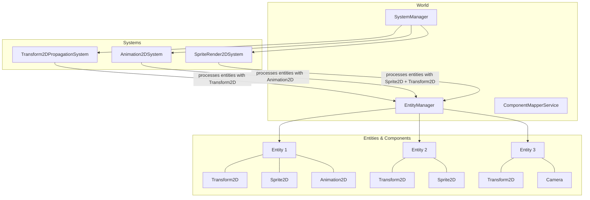
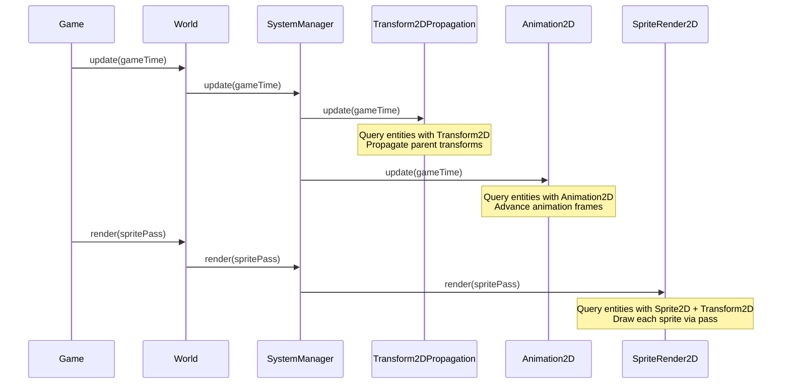

# 15. Entity Component System (ECS)

## Overview

The engine includes a custom ECS framework for organizing game logic. Entities are IDs, components hold data, and systems process entities matching specific component requirements.

## Architecture



## World

`World` (`core/src/main/java/hu/mudlee/core/ecs/World.java`) is the top-level ECS container:

```java
var world = new World();

// Add systems
world.addSystem(new Transform2DPropagationSystem());
world.addSystem(new Animation2DSystem());
world.addSystem(new SpriteRender2DSystem());

// Create entities
var entities = world.getEntities();
var player = entities.createEntity();
entities.addComponent(player, new Transform2DComponent());
entities.addComponent(player, new Sprite2DComponent(texture));

// Each frame
world.update(gameTime);                    // Logic systems
world.render(spriteRenderPass);            // Render systems

// Cleanup
world.dispose();
```

## Entity

`Entity` (`core/src/main/java/hu/mudlee/core/ecs/Entity.java`) is a simple record wrapping an integer ID:

```java
public record Entity(int id) {}
```

Entity IDs are recycled when entities are destroyed (via a free list in `EntityManager`).

## Component

`Component` (`core/src/main/java/hu/mudlee/core/ecs/Component.java`) is a marker interface — any class implementing it can be attached to an entity:

```java
public interface Component {}

// Example
public class Transform2DComponent implements Component {
    public final Vector2f position = new Vector2f();
    public float rotation = 0f;
    public float scale = 1f;
}
```

Components are pure data containers. They should not contain logic.

## EntityManager

`EntityManager` (`core/src/main/java/hu/mudlee/core/ecs/EntityManager.java`) stores all entities and their components:

### Storage

```
byType:   Map<ComponentClass, Map<EntityId, Component>>
byEntity: Map<EntityId, Set<ComponentClass>>
```

This dual-index allows both "get all entities with Transform2D" and "get all components on entity 5" to be fast.

### Query Caching

```java
// Returns all entities that have BOTH Transform2D AND Sprite2D
var entities = entityManager.getEntitiesWith(
    Transform2DComponent.class,
    Sprite2DComponent.class
);
```

Queries are cached. The cache is invalidated when the structure changes (entity created/destroyed, component added/removed), tracked via a `structureVersion` counter.

### Key Methods

| Method | Description |
|--------|-------------|
| `createEntity()` | Allocates a new entity (or recycles a free ID) |
| `destroyEntity(Entity)` | Removes all components and frees the ID |
| `addComponent(Entity, Component)` | Attach a component |
| `removeComponent(Entity, Class)` | Detach a component |
| `getComponent(Entity, Class)` | Get a specific component |
| `hasComponent(Entity, Class)` | Check if entity has component |
| `getEntitiesWith(Class...)` | Query entities matching aspect |

## Aspect

`Aspect` (`core/src/main/java/hu/mudlee/core/ecs/Aspect.java`) defines what components a system requires:

```java
public record Aspect(Class<? extends Component>... all) {}
```

An entity matches an aspect if it has ALL of the required components.

## ComponentMapper

`ComponentMapper<T>` (`core/src/main/java/hu/mudlee/core/ecs/ComponentMapper.java`) provides type-safe component access:

```java
var transformMapper = componentMapperService.getMapper(Transform2DComponent.class);

// In system processing:
var transform = transformMapper.get(entity);
transform.position.set(100, 200);
```

## SystemBase

`SystemBase` (`core/src/main/java/hu/mudlee/core/ecs/SystemBase.java`) is the base class for all systems:

```java
public abstract class SystemBase {
    protected void initialize(ComponentMapperService service) {
        // Get component mappers here
    }

    protected void onStart() {
        // Called once after all systems are added
    }

    public abstract void update(GameTime gameTime);

    protected void onDispose() {
        // Cleanup
    }
}
```

### EntityProcessingSystem

`EntityProcessingSystem` (`core/src/main/java/hu/mudlee/core/ecs/EntityProcessingSystem.java`) is a convenience base that automatically queries entities and calls `process()` for each:

```java
public class MySystem extends EntityProcessingSystem {
    public MySystem() {
        super(new Aspect(Transform2DComponent.class, Sprite2DComponent.class));
    }

    @Override
    protected void process(GameTime gameTime, Entity entity) {
        var transform = transformMapper.get(entity);
        // Process this entity...
    }
}
```

### RenderSystemBase

`RenderSystemBase` (`core/src/main/java/hu/mudlee/core/ecs/RenderSystemBase.java`) is for systems that render. Called during `world.render()` instead of `world.update()`.

## Built-In Components

| Component | File | Fields |
|-----------|------|--------|
| `Transform2DComponent` | `ecs/component/Transform2DComponent.java` | position (Vector2f), rotation, scale |
| `Sprite2DComponent` | `ecs/component/Sprite2DComponent.java` | texture/region, color |
| `Animation2DComponent` | `ecs/component/Animation2DComponent.java` | animation player, playback state |
| `CameraComponent` | `ecs/component/CameraComponent.java` | camera instance (2D or 3D) |

## Built-In Systems

| System | File | Processes | Does |
|--------|------|-----------|------|
| `Transform2DPropagationSystem` | `ecs/system/Transform2DPropagationSystem.java` | Transform2D | Propagates parent→child transforms |
| `Animation2DSystem` | `ecs/system/Animation2DSystem.java` | Animation2D | Updates animation frame based on elapsed time |
| `SpriteRender2DSystem` | `ecs/system/SpriteRender2DSystem.java` | Sprite2D + Transform2D | Draws sprites through SpriteRenderPass |

## SystemManager

`SystemManager` (`core/src/main/java/hu/mudlee/core/ecs/SystemManager.java`) maintains the system collection and dispatches `update()` and `render()` calls to all registered systems.

## ECS Update Flow


