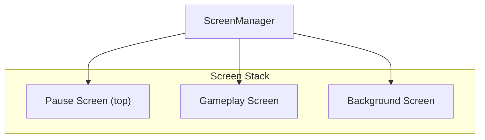
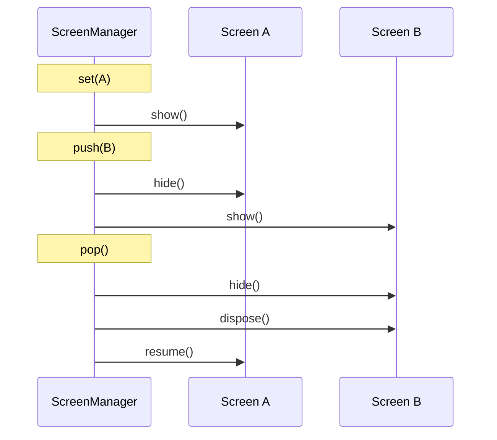

# 16. Screen Management

## Overview

The screen system provides a stack-based way to manage game states (menus, gameplay, pause screens, overlays).

## Screen Interface

`Screen` (`core/src/main/java/hu/mudlee/core/Screen.java`):

```java
public interface Screen {
    void show();                    // Called when screen becomes active
    void resume();                  // Called when screen returns to top of stack
    void update(GameTime gameTime); // Logic update
    void draw(GameTime gameTime);   // Rendering
    void resize(int width, int height); // Window resize
    void hide();                    // Called when screen is covered or removed
    void dispose();                 // Cleanup
}
```

## ScreenManager

`ScreenManager` (`core/src/main/java/hu/mudlee/core/ScreenManager.java`) extends `GameModule` and manages a stack of screens:



### Operations

| Method | Behavior |
|--------|----------|
| `set(Screen)` | Replace the entire stack with a single screen |
| `push(Screen)` | Add a screen on top (hides current top) |
| `pop()` | Remove top screen, resume the one beneath |

### Lifecycle Calls



### Deferred Transitions

Screen transitions are **queued** during the frame and applied after `draw()` completes. This prevents modifying the screen stack while iterating over it.

### Resize Forwarding

When the window resizes, **all screens** in the stack receive `resize()` — not just the top one. This ensures background screens update their layout.

## Usage Example

```java
public class MyGame extends Game {
    private ScreenManager screenManager;

    public MyGame() {
        screenManager = new ScreenManager();
        addModule(screenManager);
    }

    @Override
    protected void initialize() {
        screenManager.set(new MainMenuScreen(screenManager));
    }
}

public class MainMenuScreen implements Screen {
    private final ScreenManager screens;

    @Override
    public void update(GameTime gameTime) {
        if (Keyboard.isPressed(Keys.ENTER)) {
            screens.set(new GameplayScreen(screens));
        }
    }

    // ... other lifecycle methods
}
```

## ScreenManager as GameModule

Since `ScreenManager` extends `GameModule`, it automatically hooks into the game loop:

| GameModule Method | Behavior |
|-------------------|----------|
| `update()` | Calls `update()` on the top screen |
| `draw()` | Calls `draw()` on the top screen, then applies deferred transitions |
| `resize(w, h)` | Forwards to all screens in the stack |
| `dispose()` | Disposes all screens |
