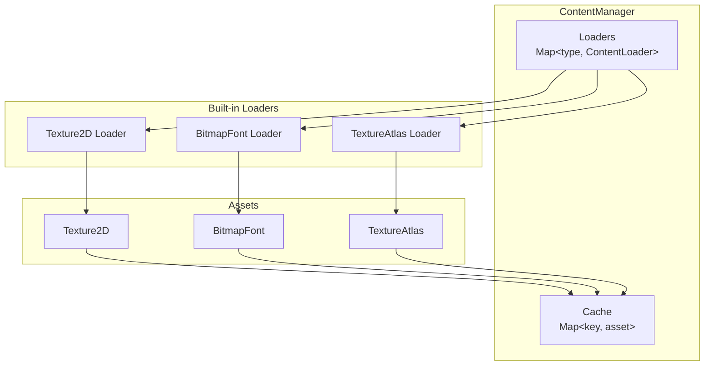
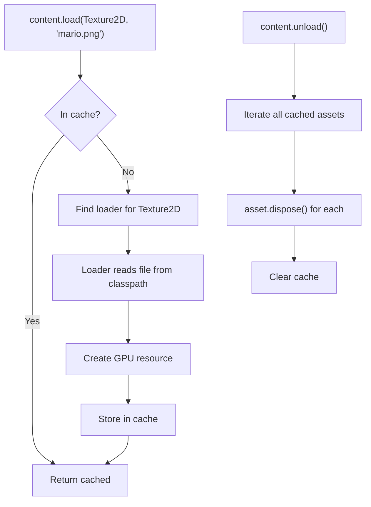

# 17. Content Management

## Overview

The content system provides centralized asset loading with caching, similar to MonoGame's `ContentManager`.

## Architecture



## ContentManager

`ContentManager` (`core/src/main/java/hu/mudlee/core/content/ContentManager.java`):

```java
// Available via this.content in Game subclass

// Load a texture (cached — second call returns same instance)
var texture = content.load(Texture2D.class, "textures/mario.png");

// Load a font
var font = content.load(BitmapFont.class, "fonts/Inter.ttf");

// Unload all cached assets (calls dispose on each)
content.unload();
```

### Key Behaviors

| Behavior | Description |
|----------|-------------|
| **Caching** | Assets loaded once by name; subsequent calls return the cached instance |
| **Type dispatch** | The `Class<T>` parameter selects the appropriate `ContentLoader` |
| **Bulk unload** | `unload()` disposes all cached assets (called during `unloadContent()`) |

## ContentLoader

`ContentLoader<T>` (`core/src/main/java/hu/mudlee/core/content/ContentLoader.java`) is the interface for asset loaders:

```java
public interface ContentLoader<T> {
    T load(ContentManager manager, String assetName);
}
```

### Registering Custom Loaders

```java
content.registerLoader(MyAssetType.class, (manager, name) -> {
    // Load and return the asset
    return new MyAssetType(name);
});
```

## ResourceLoader

`ResourceLoader` (`core/src/main/java/hu/mudlee/core/io/ResourceLoader.java`) is a utility for loading raw files from the classpath:

```java
String shaderSource = ResourceLoader.load("shaders/vulkan/3d/vert.glsl");
```

This is used internally by shader loading and can be used for any text resource.

## Asset Lifecycle



## Built-in Loaders

| Type | Source | Creates |
|------|--------|---------|
| `Texture2D` | PNG/JPG via STB Image | VulkanTexture2D with GPU image + descriptor set |
| `BitmapFont` | TTF font file | Bitmap font with glyph atlas |
| `TextureAtlas` | Texture + region definitions | Atlas with named TextureRegion entries |
