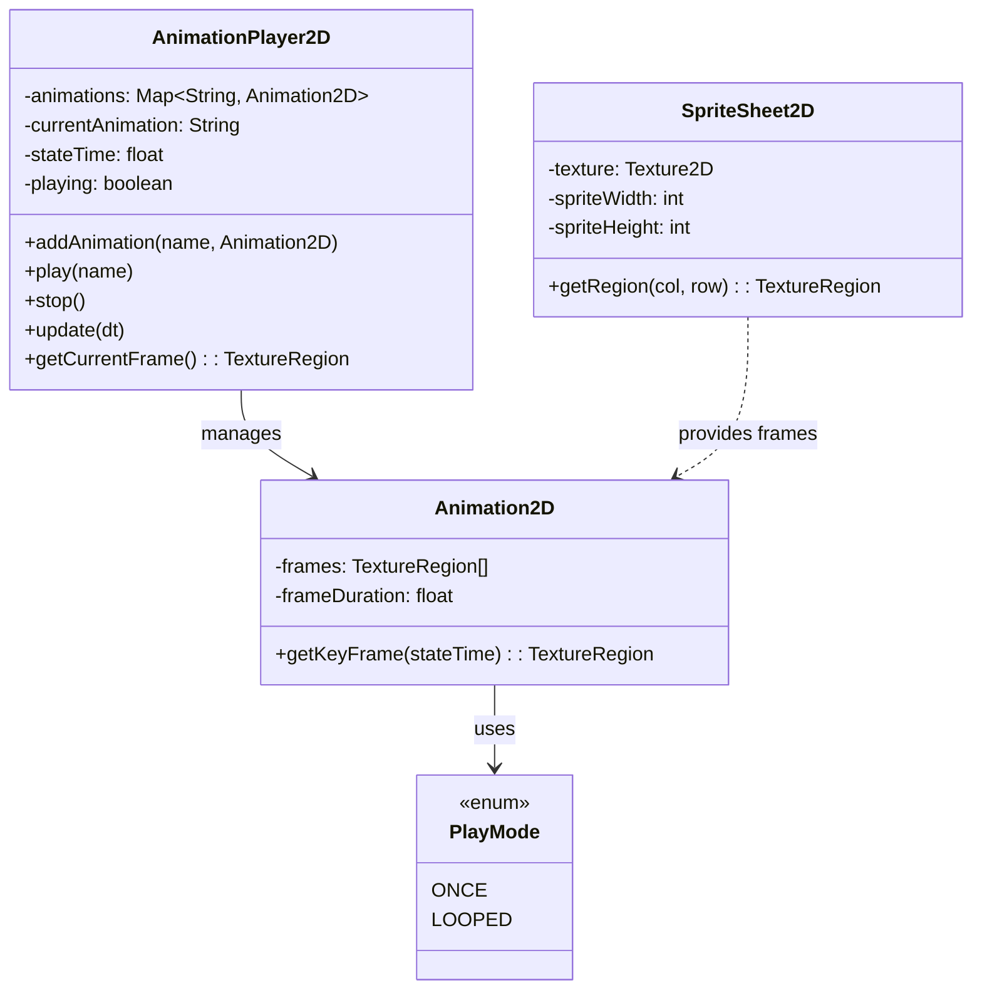
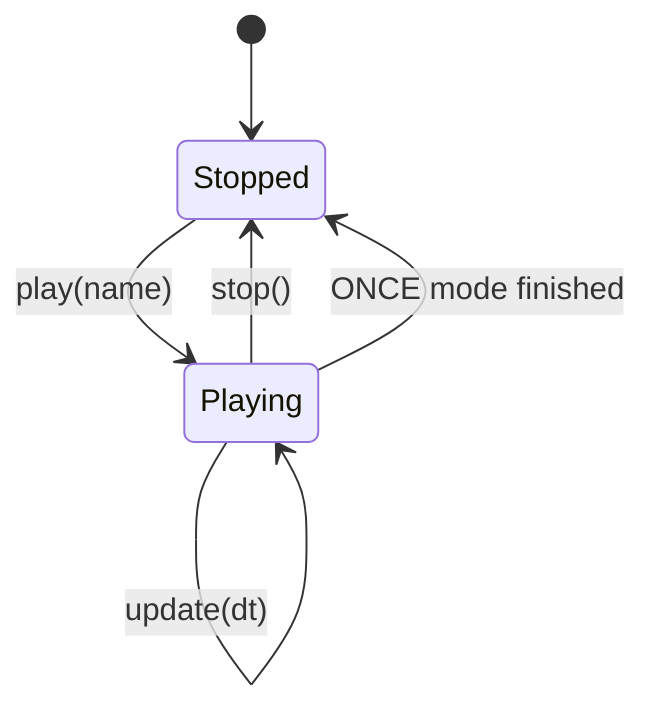
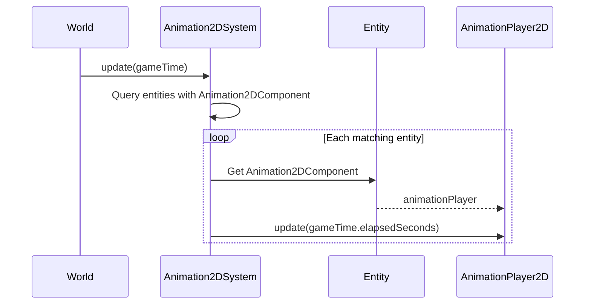

# 18. Animation System

## Overview

The 2D animation system provides keyframe-based sprite animation using texture regions from sprite sheets.

## Class Diagram



## Animation2D

`Animation2D` (`core/src/main/java/hu/mudlee/core/render/animation/Animation2D.java`) defines an animation as a sequence of texture regions:

```java
// Create from sprite sheet regions
var walkFrames = new TextureRegion[] {
    sheet.getRegion(0, 1),  // column 0, row 1
    sheet.getRegion(1, 1),  // column 1, row 1
    sheet.getRegion(2, 1),  // column 2, row 1
    sheet.getRegion(3, 1),  // column 3, row 1
    sheet.getRegion(4, 1),
    sheet.getRegion(5, 1),
};

var walkAnimation = new Animation2D(0.08f, walkFrames); // 0.08s per frame
```

### getKeyFrame()

Given a time value, returns the appropriate frame:

```
frameIndex = (int)(stateTime / frameDuration) % frameCount
```

For `ONCE` mode, clamps to the last frame instead of wrapping.

## PlayMode

| Mode | Behavior |
|------|----------|
| `ONCE` | Plays through frames once, then stays on the last frame |
| `LOOPED` | Loops back to the first frame after reaching the end |

## AnimationPlayer2D

`AnimationPlayer2D` (`core/src/main/java/hu/mudlee/core/render/animation/AnimationPlayer2D.java`) manages named animations and playback state:

```java
var player = new AnimationPlayer2D();

// Register animations
player.addAnimation("idle_down", idleDownAnim);
player.addAnimation("walk_down", walkDownAnim);
player.addAnimation("attack_down", attackDownAnim);

// Play an animation
player.play("walk_down");

// Each frame
player.update(gameTime.elapsedSeconds());

// Get current frame for rendering
TextureRegion frame = player.getCurrentFrame();
```

### State Machine



## Integration with ECS

### Animation2DComponent

`Animation2DComponent` (`core/src/main/java/hu/mudlee/core/ecs/component/Animation2DComponent.java`) holds an `AnimationPlayer2D` on an entity.

### Animation2DSystem

`Animation2DSystem` (`core/src/main/java/hu/mudlee/core/ecs/system/Animation2DSystem.java`) updates all animation players:



The `SpriteRender2DSystem` then reads the current frame from the animation player to draw the correct sprite.

## Complete Animation Setup Example

From the PlayerScene in the sandbox:

```java
// 1. Load sprite sheet
var texture = content.load(Texture2D.class, "textures/sprites/player.png");
var sheet = new SpriteSheet2D(texture, 48, 48);

// 2. Define animations from grid positions
var idleDown = new Animation2D(0.12f, new TextureRegion[] {
    sheet.getRegion(0, 0), sheet.getRegion(1, 0),
    sheet.getRegion(2, 0), sheet.getRegion(3, 0),
    sheet.getRegion(4, 0), sheet.getRegion(5, 0)
});

var walkDown = new Animation2D(0.08f, new TextureRegion[] {
    sheet.getRegion(0, 1), sheet.getRegion(1, 1),
    sheet.getRegion(2, 1), sheet.getRegion(3, 1),
    sheet.getRegion(4, 1), sheet.getRegion(5, 1)
});

// 3. Create player with animation
var player = entities.createEntity();
entities.addComponent(player, new Transform2DComponent());
entities.addComponent(player, new Sprite2DComponent(sheet.getRegion(0, 0)));

var animComponent = new Animation2DComponent();
animComponent.getPlayer().addAnimation("idle_down", idleDown);
animComponent.getPlayer().addAnimation("walk_down", walkDown);
animComponent.getPlayer().play("idle_down");
entities.addComponent(player, animComponent);
```
