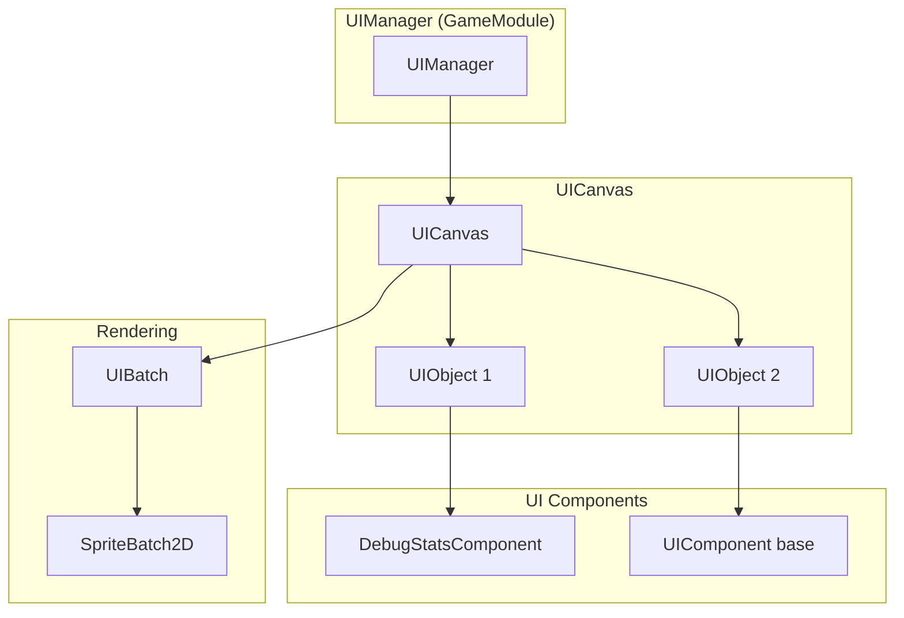

# 19. UI System

## Overview

The UI system provides an overlay layer for debug information and UI components that render on top of game content.

## Architecture



## UIManager

`UIManager` (`core/src/main/java/hu/mudlee/core/ui/UIManager.java`) extends `GameModule` and renders the UI overlay after all game content:

```java
var uiManager = new UIManager();
addModule(uiManager);

// Add UI components
uiManager.add(new DebugStatsComponent());
```

Since it's a `GameModule`, it automatically hooks into the game loop after the game's own `draw()` call.

## UICanvas

`UICanvas` (`core/src/main/java/hu/mudlee/core/ui/UICanvas.java`) is the root container for UI objects. It manages layout and hit testing.

## UIObject

`UIObject` (`core/src/main/java/hu/mudlee/core/ui/UIObject.java`) is the base class for anything placed on the canvas.

## UITransform

`UITransform` (`core/src/main/java/hu/mudlee/core/ui/UITransform.java`) defines position and size for UI elements.

## UIComponent

`UIComponent` (`core/src/main/java/hu/mudlee/core/ui/UIComponent.java`) is the base for interactive/visual UI elements.

## UIBatch

`UIBatch` (`core/src/main/java/hu/mudlee/core/ui/UIBatch.java`) handles batched rendering of UI elements, similar to `SpriteBatch2D` but optimized for the UI overlay pass.

## DebugStatsComponent

`DebugStatsComponent` (`core/src/main/java/hu/mudlee/core/ui/DebugStatsComponent.java`) displays real-time engine statistics:

| Stat | Source |
|------|--------|
| FPS | Frame time calculation |
| Frame time | `GameTime.elapsedSeconds` |
| Draw calls | `Renderer.drawCallCount` |
| Vertices | `Renderer.vertexCount` |
| Textures | `Renderer.textureCount` |
| Batch flushes | `Renderer.spriteBatchFlushCount` |
| Memory | JVM runtime memory |

### Color-Coded Thresholds

`StatThreshold` (`core/src/main/java/hu/mudlee/core/ui/StatThreshold.java`) and `WarningLevel` (`core/src/main/java/hu/mudlee/core/ui/WarningLevel.java`) provide color-coded warnings:

| Level | Color | Meaning |
|-------|-------|---------|
| NORMAL | Green | Healthy |
| WARNING | Yellow | Degraded |
| CRITICAL | Red | Performance issue |

## BitmapFont

`BitmapFont` (`core/src/main/java/hu/mudlee/core/render/font/BitmapFont.java`) renders text using a pre-rasterized glyph atlas. Used by the UI system for debug text.

```java
var font = content.load(BitmapFont.class, "fonts/Inter.ttf");
font.draw(spriteBatch, "FPS: 60", x, y);

// Measure text dimensions
var bounds = font.measure("Hello World");
```
