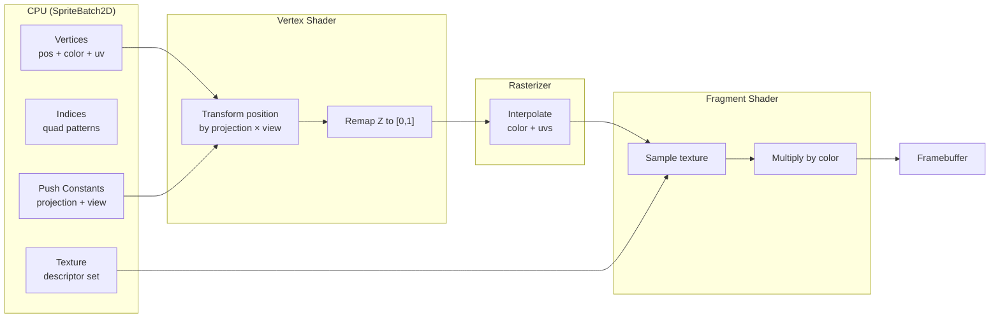
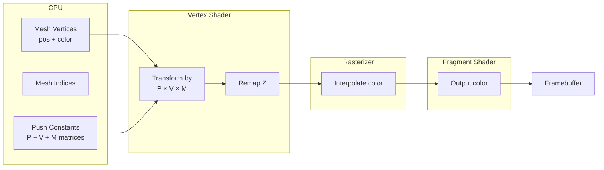

# 20. Shader Reference

## Overview

All shaders are GLSL 450 targeting Vulkan's SPIR-V. They live under `resources/shaders/vulkan/`.

## Shader Compilation

GLSL files are compiled to SPIR-V (`.spv`) in two ways:

1. **Pre-compiled**: Run `glslc` manually (command documented in shader comments)
2. **Runtime**: If no `.spv` file exists, the engine compiles via **shaderc** at load time

```bash
# Manual compilation
glslc -fshader-stage=vert vert.glsl -o vert.spv
glslc -fshader-stage=frag frag.glsl -o frag.spv
```

## 2D Sprite Pipeline

### Vertex Shader (`vulkan/2d/vert.glsl`)

```glsl
#version 450

// Push constants — camera matrices (128 bytes total)
layout(push_constant) uniform PushConstants {
    mat4 projection;   // bytes 0-63
    mat4 view;         // bytes 64-127
} pc;

// Vertex inputs (from SpriteBatch2D vertex layout)
layout(location = 0) in vec3 inPosition;    // 12 bytes
layout(location = 1) in vec4 inColor;       // 16 bytes
layout(location = 2) in vec2 inTexCoords;   //  8 bytes
                                            // Total: 36 bytes/vertex

// Outputs to fragment shader
layout(location = 0) out vec4 fragColor;
layout(location = 1) out vec2 fragTexCoords;

void main() {
    gl_Position = pc.projection * pc.view * vec4(inPosition, 1.0);

    // Vulkan NDC z-remap: OpenGL uses [-w, w], Vulkan uses [0, w]
    gl_Position.z = (gl_Position.z + gl_Position.w) * 0.5;

    fragColor = inColor;
    fragTexCoords = inTexCoords;
}
```

**Key points:**
- Uses push constants (not uniform buffers) for matrices — fastest small-data path
- Z-coordinate remapping converts OpenGL-style clip space to Vulkan's [0, 1] depth range
- No model matrix — 2D sprites have their positions baked into the vertex data by SpriteBatch2D

### Fragment Shader (`vulkan/2d/frag.glsl`)

```glsl
#version 450

// Texture sampler (descriptor set 0, binding 0)
layout(set = 0, binding = 0) uniform sampler2D texSampler;

// Inputs from vertex shader
layout(location = 0) in vec4 fragColor;
layout(location = 1) in vec2 fragTexCoords;

// Output
layout(location = 0) out vec4 outColor;

void main() {
    outColor = texture(texSampler, fragTexCoords) * fragColor;
}
```

**Key points:**
- Samples texture at interpolated UV coordinates
- Multiplies by vertex color — allows color tinting/modulation
- White vertex color = texture as-is; colored = tinted

### 2D Data Flow



## 3D Colored Geometry Pipeline

### Vertex Shader (`vulkan/3d/vert.glsl`)

```glsl
#version 450

// Push constants — camera + model matrices
layout(push_constant) uniform PushConstants {
    mat4 projection;   // bytes 0-63
    mat4 view;         // bytes 64-127
    mat4 model;        // bytes 128-191
} pc;

// Vertex inputs (from CubeMesh vertex layout)
layout(location = 0) in vec3 inPosition;    // 12 bytes
layout(location = 1) in vec4 inColor;       // 16 bytes
                                            // Total: 28 bytes/vertex

// Output to fragment shader
layout(location = 0) out vec4 fragColor;

void main() {
    gl_Position = pc.projection * pc.view * pc.model * vec4(inPosition, 1.0);

    // Vulkan NDC z-remap
    gl_Position.z = (gl_Position.z + gl_Position.w) * 0.5;

    fragColor = inColor;
}
```

**Key points:**
- Includes a **model matrix** (192 bytes of push constants total)
- Full MVP transform: projection × view × model × position
- No texture coordinates — pure colored geometry

### Fragment Shader (`vulkan/3d/frag.glsl`)

```glsl
#version 450

// Input from vertex shader
layout(location = 0) in vec4 fragColor;

// Output
layout(location = 0) out vec4 outColor;

void main() {
    outColor = fragColor;
}
```

**Key points:**
- Simple pass-through — outputs interpolated vertex color
- No texturing, no lighting (yet)

### 3D Data Flow



## Push Constant Layout Summary

### 2D Shaders (128 bytes)

| Offset | Size | Content |
|--------|------|---------|
| 0 | 64 | Projection matrix (mat4) |
| 64 | 64 | View matrix (mat4) |

### 3D Shaders (192 bytes)

| Offset | Size | Content |
|--------|------|---------|
| 0 | 64 | Projection matrix (mat4) |
| 64 | 64 | View matrix (mat4) |
| 128 | 64 | Model matrix (mat4) |

## Why Push Constants?

| Approach | When Updated | GPU Access |
|----------|-------------|------------|
| **Push constants** | Per draw call via vkCmdPushConstants | Inline in command stream — fastest |
| Uniform buffers (UBO) | Written to buffer, bound via descriptor | Requires buffer allocation per frame |
| Storage buffers (SSBO) | Written to buffer | Most flexible, slower access |

Push constants are ideal for small, frequently-changing data like matrices. The 128-byte minimum guarantee from Vulkan fits projection + view exactly. The engine requests 192 bytes for the 3D pipeline (which most GPUs support — typical max is 256 bytes).

## Vulkan NDC Z-Remap Explained

OpenGL clip space Z range: `[-w, +w]` → NDC `[-1, +1]`
Vulkan clip space Z range: `[0, +w]` → NDC `[0, +1]`

The remap formula converts from OpenGL-style to Vulkan-style:

```glsl
gl_Position.z = (gl_Position.z + gl_Position.w) * 0.5;
```

This maps `-w → 0` and `+w → +w`, matching Vulkan's expected range. This approach allows using standard JOML projection matrices (which assume OpenGL conventions) without modification.
