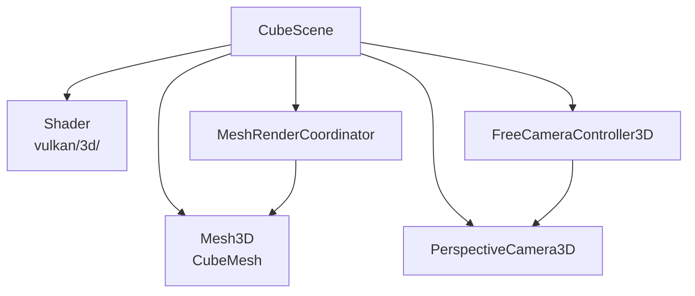
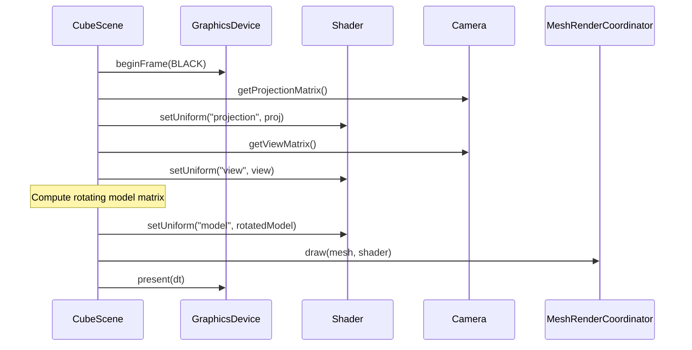
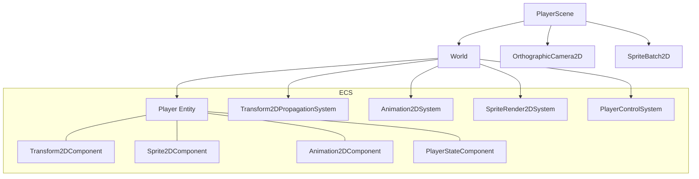
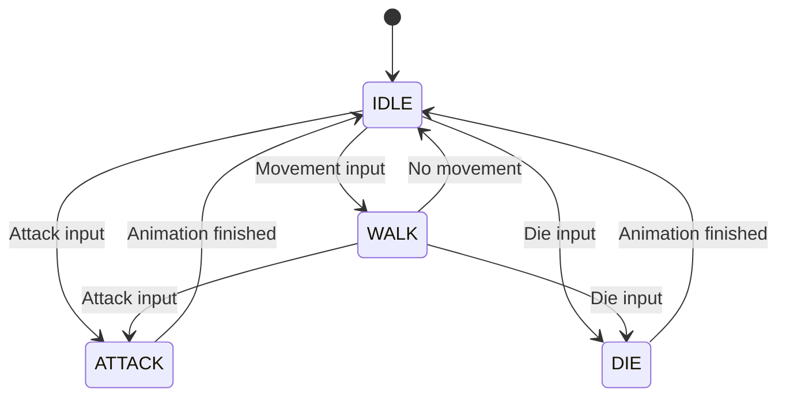
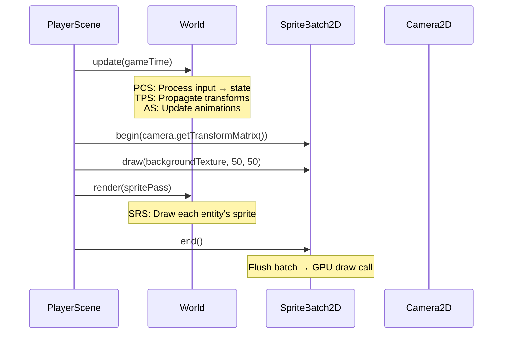

# 21. Sandbox Examples

The sandbox module demonstrates engine features with two scenes.

## SandboxApplication

`sandbox/src/main/java/hu/mudlee/sandbox/SandboxApplication.java`

The entry point that configures and launches the engine:

```java
public class SandboxApplication extends Game {
    public SandboxApplication() {
        var gdm = new GraphicsDeviceManager(this);
        gdm.setPreferredBackBufferWidth(1920);
        gdm.setPreferredBackBufferHeight(1080);
        gdm.setTitle("TESTING");
        gdm.setVSync(true);
        gdm.setPreferredBackend(RenderBackend.VULKAN);

        var screenManager = new ScreenManager();
        addModule(screenManager);

        var uiManager = new UIManager();
        uiManager.add(new DebugStatsComponent());
        addModule(uiManager);
    }

    @Override
    protected void initialize() {
        // Set initial screen (CubeScene or PlayerScene)
    }
}
```

## CubeScene — 3D Rendering Demo

`sandbox/src/main/java/hu/mudlee/sandbox/CubeScene.java`

### What It Demonstrates

- 3D perspective camera with free-fly controller
- Colored cube mesh rendering
- Per-frame model matrix rotation
- Depth testing
- Gamepad + keyboard/mouse input

### Architecture



### Render Loop



### Controls

| Input | Action |
|-------|--------|
| WASD | Move camera |
| Mouse (captured) | Look around |
| Space | Rise |
| Left Ctrl | Descend |
| Left Shift | Sprint |
| Tab | Toggle mouse capture |
| ESC | Exit |
| Gamepad left stick | Move |
| Gamepad right stick | Look |
| Gamepad LB/RB | Descend/Rise |
| Gamepad Start | Exit |

## PlayerScene — 2D Sprite & ECS Demo

`sandbox/src/main/java/hu/mudlee/sandbox/PlayerScene.java`

### What It Demonstrates

- 2D sprite rendering with SpriteBatch2D
- Sprite sheet animation (idle, walk, attack, die)
- ECS-based game logic
- Action-based input mapping
- Orthographic 2D camera

### Architecture



### Player State Machine



### PlayerStateComponent

`sandbox/src/main/java/hu/mudlee/sandbox/PlayerStateComponent.java`

Tracks player state and facing direction:

| Field | Values |
|-------|--------|
| State | IDLE, WALK, ATTACK, DIE |
| Direction | UP, DOWN, LEFT, RIGHT |

### PlayerControlSystem

`sandbox/src/main/java/hu/mudlee/sandbox/PlayerControlSystem.java`

Processes input and updates player state:

1. Read movement input (WASD / gamepad)
2. Update facing direction based on input
3. Transition state (IDLE ↔ WALK, → ATTACK, → DIE)
4. Select appropriate animation based on state + direction
5. Update transform position

### Sprite Animations

| Animation | Frames | Duration | Direction Variants |
|-----------|--------|----------|-------------------|
| Idle | 6 | 0.12s/frame | Up, Down, Left, Right |
| Walk | 6 | 0.08s/frame | Up, Down, Left, Right |
| Attack | 4 | 0.10s/frame | Up, Down, Left, Right |
| Die | 3 | 0.20s/frame | Single direction |

### Render Loop



## Switching Scenes

In `SandboxApplication.initialize()`, change which screen is set:

```java
// 3D demo
screenManager.set(new CubeScene(graphicsDevice, content));

// 2D demo
screenManager.set(new PlayerScene(graphicsDevice, content));
```
